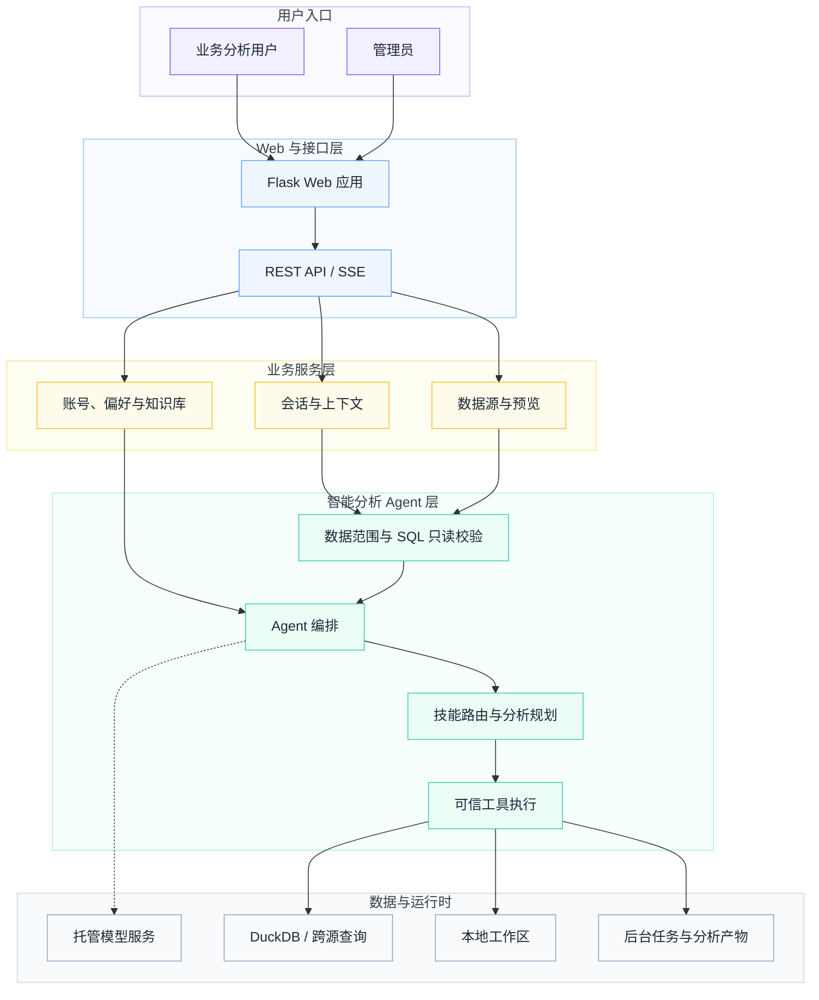

# 数探 Agent 系统架构

## 设计目标

数探 Agent 将数据接入、自然语言分析、工具执行和结果交付放在同一个工作台中。架构重点是四件事：

1. **数据范围明确**：用户能看到当前数据源、数据表、字段和本轮分析上下文。
2. **工具过程可观察**：查询、统计、图表和导出以结构化事件反馈到前端。
3. **计算与表达分离**：数值计算交给确定性代码，模型负责理解意图、选择工具和组织结论。
4. **本地数据可管理**：上传、会话、知识、任务和产物进入统一的运行数据目录。

## 系统分层

## 前端

- `templates/agent_chat.html` 提供主工作台的语义结构和可访问性基础。
- `frontend/core/` 包含 API Client、状态存储、事件总线、Overlay、主题和页面运行时。
- `frontend/features/` 按聊天、模型、知识库、MCP、Skills、Teams 和 Workspace 拆分功能。
- `frontend/legacy/` 保留经过模块化封装的会话、数据源、预览、国际化和历史记录实现。
- `static/frontend/` 是无需 Node.js 即可运行的浏览器资源；`static/dist/` 保存 Vite 构建产物。
- Vue 以渐进式交互岛接管复杂面板，主页面仍能通过模块化 JavaScript 独立启动。

## API 与实时事件

`api/` 通过 Flask Blueprint 按领域拆分。主要接口覆盖：

- 会话创建、保存、恢复与对话流；
- 文件、SQL、Google Sheets、HTTP API 与工作目录数据源；
- 托管模型服务状态、路由与连接健康检查；
- 数据知识库、个人偏好和账号历史；
- 技能、命令、Hooks、MCP 与 Teams；
- 后台任务、Checkpoint、图表和产物下载。

AI 回答使用 SSE 传递文本增量、分析状态、工具调用、表格、图表引用、任务状态、确认请求和错误事件。前端根据事件类型增量更新消息，避免等待整个分析结束后才显示结果。

## Agent 核心

`agent/agent.py` 负责模型交互和工具循环。它与以下模块协作：

- `agent/tools/registry.py`：工具元数据、数据要求和暴露策略；
- `agent/skills/`：技能发现、解析、意图路由和执行；
- `agent/commands/`：斜杠命令目录、可用性与分发；
- `agent/jobs.py`：后台任务生命周期和取消控制；
- `agent/retry.py`：可恢复错误的重试策略；
- `agent/compaction.py`：长会话上下文压缩；
- `agent/hooks/`：生命周期 Hook；
- `agent/tools/workspace/`：受权限约束的文件与任务操作。

工具结果采用结构化协议返回。模型可以解释结果，但查询表格、统计指标、规则命中和导出内容由代码执行。

## 数据层

`data/sources/` 为不同数据源提供统一接口：

- CSV / Excel 文件；
- SQLAlchemy 数据库；
- Google Sheets；
- HTTP JSON API；
- 持久化工作目录数据。

pandas 用于表格处理，DuckDB 用于本地查询与工作区缓存，sqlglot 用于 SQL AST 解析和只读校验。数据源快照会和会话关联，历史恢复时重新构建可用上下文。

## 分析与输出

`Function/` 包含分析、清洗、图表和交付模块：

- 回归、逻辑回归、决策树、K-Means、变量筛选和十分位分析；
- ARIMA、SARIMA、Prophet、VAR 和 GRU 时间序列入口；
- 多类型图表自动选择与渲染；
- 数据表、Excel、Word、PDF、PPT 和 Dashboard 输出。

`domain/`、`services/`、`diagnosis/` 和 `agents/ecommerce_orchestrator.py` 提供确定性的电商示例工作流，包括字段映射、质量检查、指标计算、周期对比和规则诊断。

## 持久化边界

运行数据通过 `BAA_DATA_DIR` 指定。默认或 Docker 部署中会保存：

- 上传文件和数据源配置；
- 会话、消息和历史索引；
- 账号、配额、偏好和知识库；
- DuckDB 工作区缓存；
- 后台任务状态与生成产物；
- 运行日志。

这些目录均不进入版本控制。部署时应将运行目录挂载到持久卷并纳入备份策略。

## 安全边界

- 跨站写请求在 Flask 层进行 Origin 校验。
- HTML 响应带有 CSP、`X-Content-Type-Options`、`Referrer-Policy` 和权限策略。
- 图表页面采用独立的受限 CSP。
- SQL 在执行前进行 AST 级只读检查。
- 工作目录读取屏蔽敏感路径，写入能力需要显式选择权限。
- 模型凭据仅保存在服务端运行环境，不进入前端、浏览器或代码仓库。
