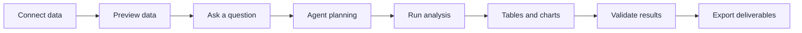
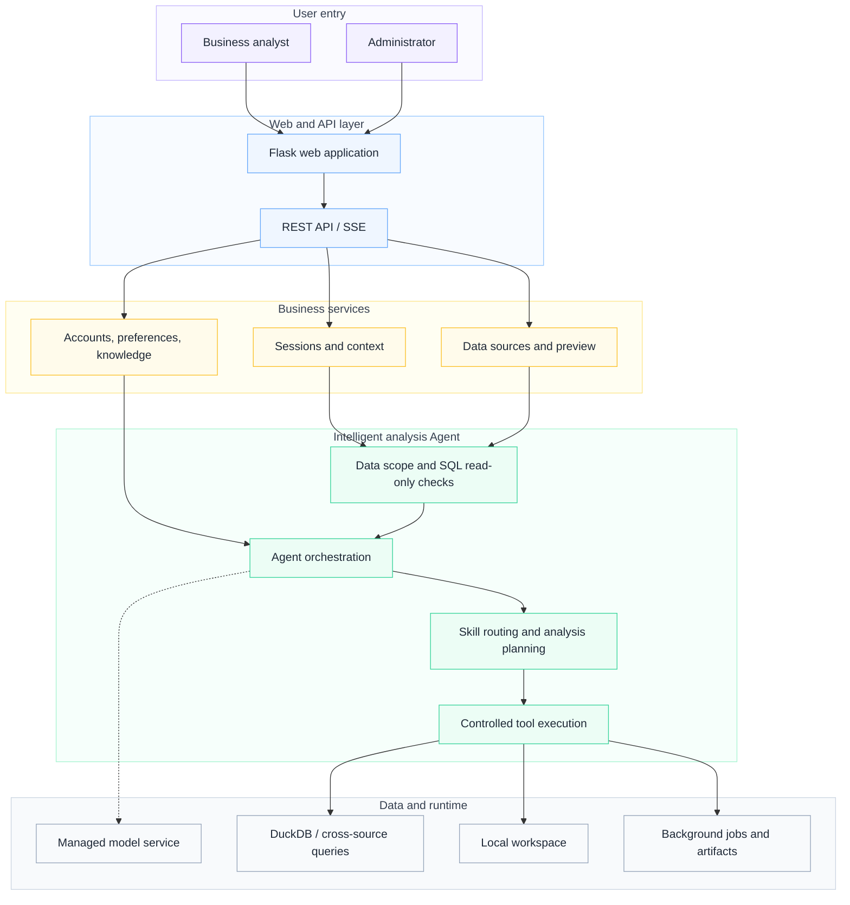

# DataScout Agent · AI Data Analysis Workspace

<p align="center">
  
</p>

<p align="center">
  <strong>Turn Excel, CSV, and connected business data into traceable, reusable analysis deliverables.</strong>
</p>

<p align="center">
  <a href="./README.md">中文</a> ·
  <a href="#quick-start">Quick Start</a> ·
  <a href="./docs/数探-Data-Analysis-Agent-PRD.md">Full PRD</a> ·
  <a href="./docs/数探-Data-Analysis-Agent-PRD-精简版.md">Concise PRD</a> ·
  <a href="./docs/product-decisions.md">Product Decisions</a> ·
  <a href="./ARCHITECTURE.md">Architecture</a> ·
  <a href="./DEPLOYMENT.md">Deployment</a>
</p>

## What it is

DataScout Agent is a conversational AI workspace for business data analysis. Its primary path starts with Excel / CSV files: upload data, inspect it, ask questions in natural language, and complete queries, statistical analysis, charts, follow-up questions, and exports in one interface. Users with configured data connections can also connect SQL databases, Google Sheets, HTTP APIs, or a local workspace.

The system keeps analytical work observable. Users can see which source is active, which tool is running, what data supports a result, and which artifact was produced. Deterministic metric, data-quality, and rule engines are available when calculations must remain independent from the language model.

## Product design

DataScout is designed around confirmable data, observable execution, and deliverable results.

Product materials (Chinese): [Full PRD](./docs/数探-Data-Analysis-Agent-PRD.md) · [Concise PRD](./docs/数探-Data-Analysis-Agent-PRD-精简版.md) · [Product Decisions](./docs/product-decisions.md)

## Highlights

| Capability | Product value |
| --- | --- |
| File-first data entry | Upload Excel / CSV files, then inspect sheets, fields, and sample rows; one session can manage multiple sources |
| Conversational analysis | Ask questions in Chinese or English and follow analysis status, tool activity, tables, charts, and conclusions |
| Controlled analysis tools | Use SQL, cleaning, statistics, and chart tools for analysis; data conclusions can be traced to execution results |
| Visible data scope | Preview schemas and rows, then explicitly select the tables used by the current turn |
| Deliverable outputs | Export datasets, Excel workbooks, reports, presentations, charts, and interactive dashboards |
| Background jobs | Monitor progress, cancel long-running operations, recover results, and download artifacts |
| Business knowledge | Maintain metric definitions, business rules, context notes, and imported knowledge files |
| Local-first storage | Keep uploads, sessions, credentials, and generated artifacts outside the repository |

## User flow



## Quick start

Requirements: Python 3.10+. Node.js is only required when rebuilding the frontend.

```bash
git clone https://github.com/qrwuu/data-analysis-agent.git
cd data-analysis-agent

python -m venv .venv
# Windows: .venv\Scripts\activate
# macOS / Linux: source .venv/bin/activate

python -m pip install --upgrade pip
python -m pip install -r requirements.txt
cp .env.example .env        # Windows PowerShell: Copy-Item .env.example .env
python app.py
```

Open <http://localhost:5001/>. The health endpoint is <http://localhost:5001/api/health>.

## Model service configuration

When deploying DataScout, configure a compatible model provider, model name, and API key in the server-side `.env` file before starting the application. This configuration remains in the deployment environment and is not exposed to the browser. After deployment, users can upload data and start analyzing it without entering model settings or API keys.

Keep credentials in the deployment environment rather than the repository. For detailed configuration steps, see [DEPLOYMENT.md](./DEPLOYMENT.md).

## How to use it

1. Select **Add data** and upload a file or connect a source.
2. Open **Data Preview** to inspect schemas, sample rows, and active tables.
3. Ask a question directly or choose an explicit analysis skill.
4. Validate tool activity, tables, and charts, then continue with follow-up questions.
5. Download the generated artifact or save the analysis session.

Example questions:

```text
Summarize revenue by region and create a descending bar chart.
Check this dataset for missing values, duplicates, and outliers.
Compare the last 12 months and explain the largest changes.
Cluster customers with K-Means and describe each segment.
Turn this analysis into an executive report.
```

The **Use sample data** action provides an immediate product walkthrough without private data.

## Data connectors

- Excel / CSV (`.xlsx`, `.xls`, `.csv`)
- SQLAlchemy databases, including MySQL, PostgreSQL, SQLite, and SQL Server
- Google Sheets with a service account
- HTTP APIs with no auth, Bearer Token, or `X-API-Key`
- Local workspaces with explicit read-only or read/write permission

## Extended analysis and delivery capabilities

Beyond the file-analysis workflow, the project also provides advanced analysis and delivery capabilities that can be enabled as needed:

- Data understanding and cleaning: profiling, missing-value handling, winsorizing, and outlier handling.
- Query and visualization: read-only SQL queries, chart selection, and multiple chart types.
- Statistics and modeling: decile analysis, feature screening, linear and logistic regression, decision trees, and K-Means.
- Time series: ARIMA, SARIMA, Prophet, VAR, and GRU.
- Delivery: funnel analysis, data exports, reports, presentations, and interactive dashboards.

## Architecture



The frontend uses Flask templates, modular JavaScript, progressive Vue islands, and Vite. The backend combines Flask, Waitress, pandas, DuckDB, SQLAlchemy, sqlglot, background jobs, local authentication, and structured Agent tooling. See [ARCHITECTURE.md](./ARCHITECTURE.md) for details.

## Docker

```bash
cp .env.example .env
cp Caddyfile.example Caddyfile
docker compose up -d --build
```

Runtime data is persisted in `runtime-data/`. See [DEPLOYMENT.md](./DEPLOYMENT.md) for HTTPS, backup, and operations guidance.

## Verification

```bash
python -m unittest Test.test_api_smoke Test.test_validate Test.test_ecommerce_metrics
pnpm install --frozen-lockfile
pnpm quality
```

## Security and privacy

Model credentials are managed on the server and never exposed to the browser or committed to the repository. SQL is guarded by AST-level read-only validation, sensitive workspace paths are blocked, and browser responses use restrictive security headers. The server sends the context required for an answer to the managed model service; enterprise deployments can select an integration that matches their data policy.

See [SECURITY.md](./SECURITY.md) for responsible disclosure.
