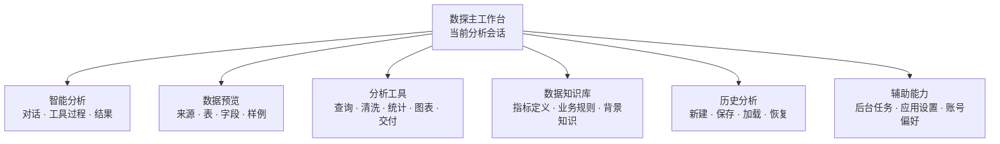
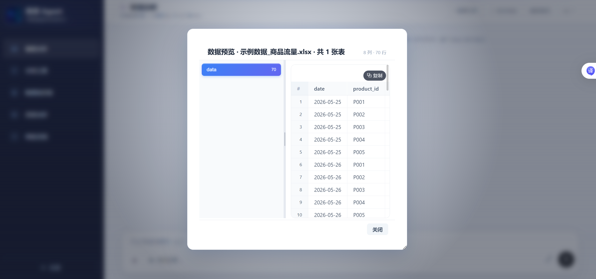
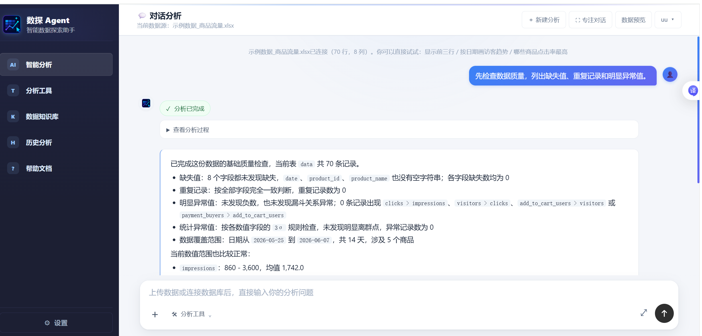
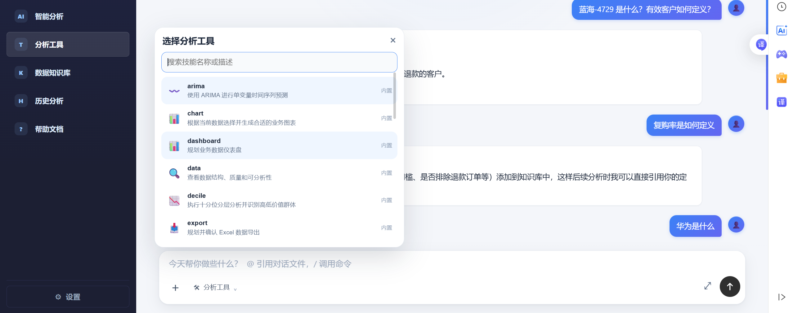
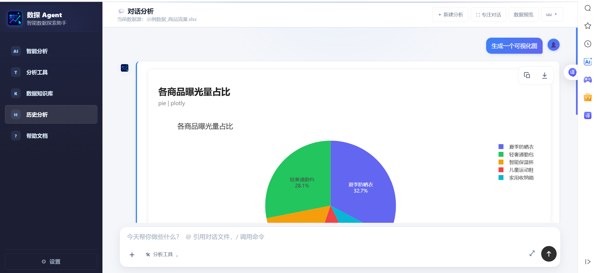
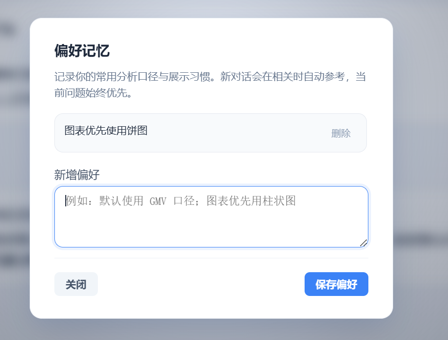
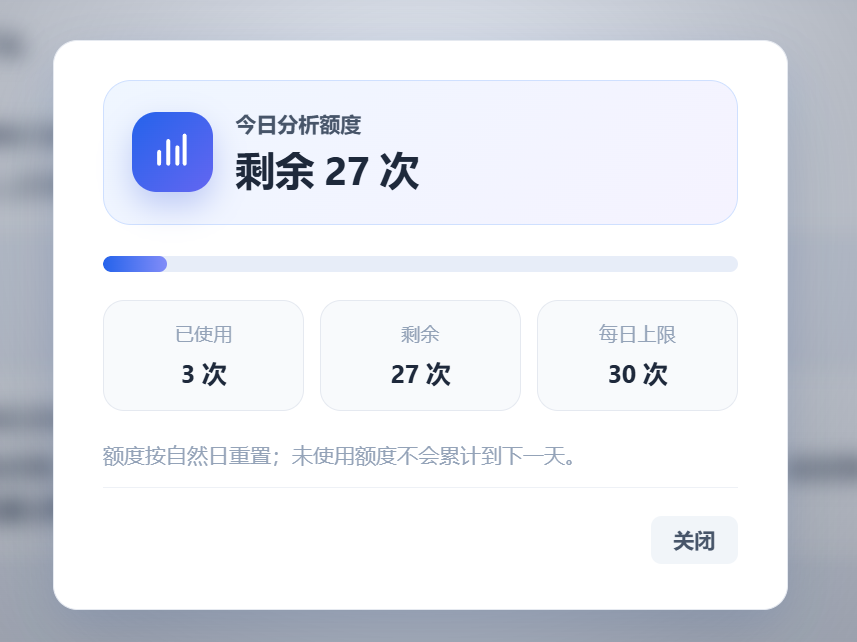
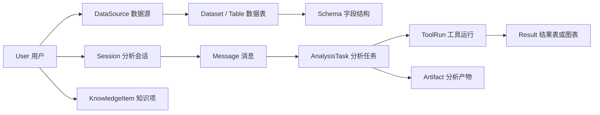

# 产品需求说明书

# 数探｜智能数据分析 Agent

| 文档项 | 内容 |
| --- | --- |
| 文档版本 | V1.1 |
| 文档状态 | 产品基线 |
| 产品形态 | 面向业务分析的对话式 AI 数据工作台 |
| 适用范围 | Web 交付版与私有化部署版 |
| 项目周期 | 2026.03—2026.05 |
| 编写日期 | 2026-05-31 |
| 保密级别 | 项目资料 |

## 修订记录

| 版本 | 日期 | 修订说明 |
| --- | --- | --- |
| V1.0 | 2026-03-10 | 建立产品需求框架，明确数据分析闭环、核心用户与版本范围 |
| V1.1 | 2026-05-31 | 完善功能规格、可信执行、安全治理、验收标准与项目交付节奏；重构目录、版本规划与展示版排版 |

---

## 目录

1. 产品背景与目标
2. 用户与使用场景
3. 产品设计概览
4. 核心功能需求
5. MVP 与版本规划
6. 关键交互与异常处理
7. 数据、安全与隐私
8. 非功能需求与技术边界
9. 验收标准与质量保障
10. 成功指标与迭代计划
11. 附录

---

# 一、产品背景与目标

## 1.1 项目背景

业务团队每天都在回答类似问题：本周销售为什么下降、哪个渠道转化更高、活动带来了多少新增、哪些客户需要重点跟进。问题本身通常不复杂，但完成一次可信分析往往要经历文件整理、字段确认、SQL 查询、图表制作、结论撰写与反复沟通。对于没有 SQL/Python 能力的运营、销售和业务负责人而言，临时分析高度依赖分析师排期或 Excel 手工处理。

通用大模型降低了提问门槛，却不能天然保证它使用了正确的数据、指标口径和计算方法；传统 BI 擅长固定报表，但对临时问题、文件起步和多轮追问的支持有限。数探的机会在于将“数据接入—范围确认—分析执行—结果验证—产物交付”压缩到同一个工作台，帮助业务人员以自然语言完成可追溯的数据分析。

## 1.2 产品目标

### 核心目标

1. 让用户无需编写 SQL/Python，即可基于已接入的数据完成常见经营分析。
2. 让每个结论可回溯到数据范围、工具执行过程、表格或图表结果，避免“只给答案、不见依据”。
3. 将一次性分析沉淀为会话和可下载产物，支持后续恢复、追问与复用。
4. 构建可持续维护的个人数据知识库，沉淀指标定义、业务规则与背景资料，使后续分析能够继承个人或团队的业务语境。

### 成功定义

用户可以在一次会话内完成：接入或选择数据、确认数据范围、提出问题、获得表格/图表/结论、继续追问、导出或保存结果。系统在不确定、超权限、无数据或工具失败时，必须给出真实、可行动的反馈，而不是编造结果。

## 1.3 需求依据、前期调研与竞品洞察

本节采用“现有产品逆向走查 + 公开资料桌面调研”的方式形成需求依据：前者核验数探已经向用户提供的页面、交互和可控执行能力；后者参考通用大模型、智能 BI 与开源数据 Agent 的公开产品文档。**不将其表述为访谈样本、市场份额或已上线经营结果。**

### 1.3.1 前期调研：问题从哪里来

业务用户的真实任务通常从一个经营问题开始，但要得到可以采用的答案，仍要经过数据选择、字段理解、口径确认、计算执行和结果交付。问题表达简单，数据处理链路却很长；任一环节不清楚，结论都可能无法复核或无法用于汇报。

当前版本的产品走查将这一问题拆成可验证的能力基线，而不是用主观感受描述“智能”：

| 观察维度 | 当前版本可核验的量化基线 | 对应产品意义 |
| --- | --- | --- |
| 首次数据入口 | **5 类**：Excel/CSV、SQL 数据库、Google Sheets、自定义 HTTP API、示例数据 | 既支持用户自带数据，也用示例数据降低空白页门槛 |
| 核心分析闭环 | **5 步**：接入/选择 → 预览字段与样例 → 确认范围 → 自然语言提问与工具执行 → 结果交付/追问 | 每个步骤都有前端入口或状态反馈，避免直接“黑盒回答” |
| 结果交付形态 | **6 类**：文字结论、表格、图表、Excel、报告/PPT、Dashboard | 使分析结果既可阅读，也可继续追问或进入交付流程 |
| 长期复用资产 | **3 类**：历史分析、个人数据知识库、偏好记忆 | 将已确认的业务术语、指标口径和展示习惯带入后续会话 |
| 需求与验收覆盖 | **16 项**功能需求（FR-01～FR-16）与 **11 项**核心验收项（AC-01～AC-11） | 将能力范围、异常反馈、权限边界和交付结果落实为可检查条目 |

这组基线说明：本项目要解决的不是“让模型回答一个问题”，而是让业务人员能在一个工作台中完成一次**数据可确认、过程可观察、结果可交付**的分析任务。

### 1.3.2 竞品分析：能力参考与产品取舍

竞品分析的目的不是评判产品优劣，而是识别不同产品范式的适用前提与用户负担。公开文档显示：通用大模型可以围绕上传文件生成表格、图表与代码支持的分析，且建议用户检查代码、输出和假设；智能 BI 的 Copilot 围绕语义模型与报表工作流提供辅助；开源数据 Agent 已支持多轮澄清、解释和可选沙箱执行。数探据此把重点放在业务分析闭环与可验证交互，而非重复建设通用模型能力。

| 参照范式与公开能力 | 适用场景与前置条件 | 数探的产品取舍 |
| --- | --- | --- |
| 通用大模型的数据分析能力（如 [ChatGPT 数据分析说明](https://help.openai.com/en/articles/8437071-data-analysis-with-chatgpt)）可处理上传文件、表格、图表与代码支持的计算 | 适合快速探索；当计算方法、字段口径或数据来源影响判断时，用户仍需主动核查假设与输出 | 固化“预览字段—确认活动数据范围—展示工具状态—引用结果”的会话结构，减少用户自行追问分析依据的成本 |
| 智能 BI Copilot（如 [Power BI Copilot 概览](https://learn.microsoft.com/en-us/power-bi/create-reports/copilot-integration)）服务于语义模型、报表制作与消费 | 适合已有模型和报表体系的场景；使用 AI 前通常需要完成数据准备、建模或既有报表建设 | 优先支持临时文件、探索式问题与连续追问；不把产品定位为替代企业 BI 的固定报表体系 |
| 开源数据 Agent（如 [PandasAI Agent 文档](https://docs.pandas-ai.com/v3/agent)）支持多轮交互、澄清、解释与可选沙箱 | 适合开发者或技术团队按代码和运行环境进行组合与扩展 | 将模型服务统一托管，向业务用户暴露数据、工具、权限和失败反馈，不要求普通用户配置模型地址或访问密钥 |

基于上述对比，数探形成四项产品决策：

1. **数据先于回答**：活动数据范围、表、字段和样例行必须在会话中可见，先确认再分析。
2. **确定性执行承接计算**：SQL、统计、清洗、图表和导出由受控工具执行；文字结论以工具结果为依据。
3. **过程可见而非黑盒**：展示工具状态、结果表、错误原因和可行动的下一步，不伪造成功或无数据结果。
4. **复用建立在私有业务语境上**：登录用户可沉淀指标定义、业务规则、背景知识、历史会话和偏好，并与其他用户隔离。

### 1.3.3 调研结论如何进入需求

调研结论被映射为需求，而不是停留在竞品描述：前两项决策进入 4.2～4.4 的数据确认、Agent 编排与执行控制；过程可见性进入 4.1、4.5 和第 6 章异常处理；业务语境复用进入 4.6、4.7 的知识库、历史、偏好和账号边界。第 5 章再以 P0/P1/P2 和验收矩阵约束交付顺序。

## 1.4 产品范围与边界

### 本版本包含

| 模块 | 范围说明 |
| --- | --- |
| 数据接入 | Excel/CSV 上传、示例数据、SQL 数据库、Google Sheets、HTTP API 与本地工作区 |
| 对话分析 | 多轮对话、流式输出、停止生成、失败重试、建议追问与显式分析工具选择 |
| 可信执行 | 数据范围确认、SQL 只读校验、工具状态展示、确定性统计与图表生成 |
| 数据处理 | 清洗、描述统计、分组汇总、趋势分析、回归、聚类、时间序列等可发现技能 |
| 结果交付 | 表格、图表、Excel、报告、PPT、Dashboard 与后台任务产物下载 |
| 复用能力 | 历史分析、知识库、指标定义、业务规则、偏好与工作区管理 |
| 基础治理 | 邮箱密码注册/登录、游客体验额度、登录用户额度、私有会话/知识库/偏好、敏感路径屏蔽与内置 Agent 服务治理 |

### 1.4.2 本版本不解决的问题

1. 不替代数据仓库、主数据治理或企业 BI 的固定报表体系。
2. 不允许 Agent 对生产数据库执行写入、删除或结构变更操作。
3. 不对字段含义不明、数据质量极差或数据缺失的问题给出确定结论。
4. 不将相关性、预测或聚类结果自动表述为因果结论或业务决策。
5. 不将模型地址、访问密钥或底层运行配置暴露给终端用户。

## 1.5 项目节奏

| 阶段 | 目标 | 核心交付 |
| --- | --- | --- |
| 2026.03｜产品定义与方案设计 | 明确目标用户、核心闭环、交互边界与数据安全原则 | PRD、信息架构、核心流程与验收基线 |
| 2026.04｜核心能力开发与联调 | 跑通文件到结论的完整闭环 | 数据接入、对话分析、工具执行、图表、导出与基础治理 |
| 2026.05｜体验完善与项目交付 | 完成功能回归、典型任务验证与展示材料整理 | 历史与知识复用、异常处理、验收用例与交付文档 |

## 1.6 项目风险摘要

| 风险 | 影响 | 缓解策略 |
| --- | --- | --- |
| 数据口径不清 | 结论与业务预期不一致 | 在预览和追问中展示字段，关键歧义要求用户确认 |
| Agent 误解意图 | 选择错误工具或分析路径 | 显式工具选择、技能路由、失败提示与继续追问 |
| 数据质量不足 | 分析结果不可用 | 提供缺失值、重复值、异常值检查，并说明数据限制 |
| SQL 或工作区越权 | 数据损坏或敏感信息泄露 | AST 只读校验、目录权限、敏感路径屏蔽与最小权限原则 |
| 长任务失败 | 用户丢失结果或重复操作 | 后台任务、进度、取消、恢复与产物持久化 |
| Agent 服务不可用 | 对话中断 | 服务端健康检查、有限重试、明确错误状态与管理员排障入口 |

---

# 二、用户与使用场景

## 2.1 目标用户

| 用户角色 | 用户描述 | 核心诉求 | 典型任务 |
| --- | --- | --- | --- |
| 业务运营人员 | 持有活动、销售、用户或渠道数据，但不熟悉 SQL/Python | 快速完成临时汇总、趋势判断与异常排查 | 活动复盘、区域对比、Top N、数据质量检查 |
| 销售/业务负责人 | 关注经营结果与行动优先级 | 获得可解释的结论和可直接汇报的图表 | 客户分层、商品贡献、渠道表现、目标追踪 |
| 数据分析师 | 需要快速探索数据和制作初步分析结果 | 减少重复取数和基础图表工作 | 字段浏览、查询验证、快速可视化、报告初稿 |
| 管理者 | 主要消费分析结果，关注结论是否可信 | 快速阅读核心发现与依据 | 查看报告、仪表盘与关键指标变化 |
| 部署管理员 | 维护服务可用性、数据边界和内置 Agent 服务 | 安全稳定运行，用户开箱即用 | 服务部署、运行监控、备份、访问保护与故障排查 |

## 2.2 使用身份与权益

| 身份状态 | 可立即使用的能力 | 需要登录后获得的能力 | 每日分析额度 |
| --- | --- | --- | --- |
| 体验用户（未登录） | 上传或选择示例数据、发起临时对话、查看当前会话结果 | 历史分析归档、个人数据知识库、偏好记忆、账号设置与跨访问恢复 | 5 次 |
| 登录用户 | 完整分析工作台、数据接入、对话、工具与结果交付 | 私有历史、个人知识库、偏好记忆、昵称与额度查看 | 30 次 |

体验模式的作用是降低首次使用门槛，而不是建立匿名长期档案。未登录会话仅在当前浏览器会话内可用；用户注册或登录后，可以将当前临时分析纳入个人历史。登录后，当日已使用的体验次数会一次性计入该账号的 30 次总额度，避免通过切换身份绕过使用限制。

## 2.3 核心用户任务

> **核心 JTBD：**当我拿到一份业务数据，并需要在有限时间内回答经营、运营或业务问题时，我希望能在一个工作台中完成数据确认、自然语言提问、分析执行、结果核验和交付导出；系统应基于我已确认的数据范围给出有依据的结果，让我不必先学习 SQL、等待分析排期或在多个工具之间反复切换。

| 核心任务 | 用户目标 | 完成标准 |
| --- | --- | --- |
| 数据准备 | 上传或连接数据后，确认系统读取的文件、字段与样例数据是否正确。 | 解析结果、字段和样例行清晰可见；文件异常时能定位到文件、工作表或字段问题。 |
| 发起分析 | 用自然语言提出“按月看销售趋势”“找出异常渠道”等业务问题。 | 系统基于活动数据执行分析，过程和结果在同一会话连续呈现。 |
| 核验交付 | 判断结论是否可靠，并用于汇报或继续追问。 | 结果包含数据范围、结果表/图表、必要的限制说明和可追问入口。 |
| 长期复用 | 沉淀常用指标口径、业务规则与历史分析。 | 知识库、会话历史和个人偏好可被保存、加载并与其他用户隔离。 |

## 2.4 典型使用场景

| 场景 | 触发问题 | 用户路径 | 关键交付 |
| --- | --- | --- | --- |
| 文件驱动的经营复盘 | “本月销售为什么变化？” | 上传 Excel/CSV，确认字段与日期范围，提出问题并追问 | 汇总表、趋势图、可下载结果 |
| 数据质量与异常排查 | “这份活动数据能否直接用于复盘？” | 查看数据预览，发起缺失值、重复记录与异常检查 | 数据质量摘要、问题字段与处理建议 |
| 口径驱动的持续分析 | “有效客户如何定义？按该口径看表现” | 在知识库维护指标或背景知识，在对话中引用并保存会话 | 可复用口径、连续对话与历史分析 |
| 面向汇报的结果交付 | “把当前分析整理成可分享的材料” | 基于已完成会话创建导出任务，查看进度并下载 | Excel、报告、PPT、图表或 Dashboard |

## 2.5 用户痛点与需求优先级

| 用户痛点 | 对应需求 | 优先级 |
| --- | --- | --- |
| 不会 SQL/Python，且文件、字段和口径难以快速确认 | 数据接入、数据预览、活动数据范围与自然语言提问 | P0 |
| 担心模型“看起来合理”但无法证明结果来源 | 可见工具状态、只读校验、结果表/图表与限制说明 | P0 |
| 分析结果难以复用，业务术语每次都要重新解释 | 历史分析、个人知识库、指标定义和偏好记忆 | P1 |
| 复杂分析或导出需要等待，失败后缺少明确下一步 | 后台任务、取消/重试、错误反馈和产物下载 | P1 |

---

# 三、产品设计概览

## 3.1 产品定位

**数探是面向业务分析的 AI 数据工作台。**它把数据源、自然语言任务、受控工具执行、可视化结果与交付产物放入同一会话，服务“基于真实数据快速完成一次可核验分析”的场景。

产品不以替代专业分析师为目标，而是降低业务人员完成基础分析的门槛：内置 Agent 理解问题并组织表达，程序完成查询、统计、图表、导出与权限校验。

## 3.2 总体流程

| 阶段 | 用户行为 | 系统职责 | 可见结果 |
| --- | --- | --- | --- |
| 数据准备 | 上传文件、连接来源或使用示例数据 | 解析、登记数据源，识别表与字段 | 数据源状态、表名、字段、样例行 |
| 范围确认 | 选择当前会话使用的数据 | 建立活动数据上下文 | 当前数据表、来源与可用字段 |
| 分析发起 | 描述问题或选择分析工具 | 识别意图、选择技能、补充必要约束 | 流式状态、澄清问题或执行计划 |
| 可信执行 | 查看或等待工具过程 | 执行只读查询、统计、清洗、图表或导出 | 工具状态、表格、图表、错误信息 |
| 结果交付 | 追问、下载、保存 | 保留上下文与产物，提供可复用入口 | 会话、Excel、报告、PPT、Dashboard |

## 3.3 信息架构

数探以“一个工作台、按需展开能力”的方式组织信息。用户围绕当前分析会话工作，数据预览、工具、知识库、历史和设置作为侧边能力按需调出，避免跳转多个割裂页面。

---

# 四、核心功能需求

## 4.1 核心工作台

### 4.1.1 页面定位

核心工作台是数探的唯一主任务页面。它不把数据、对话、工具、结果和交付拆散到多个孤立页面，而是围绕一次分析会话组织信息。用户在同一个视图中完成数据选择、问题输入、过程观察、结果核验和产物交付。

### 4.1.2 页面结构

| 区域 | 页面内容 | 设计目的 |
| --- | --- | --- |
| 顶部操作区 | 新建分析、数据预览、专注模式、语言/主题、账号入口 | 保持会话级操作可见，不打断当前分析 |
| 左侧能力区 | 智能分析、分析工具、知识库、历史分析、后台任务 | 在不离开工作台的前提下切换分析上下文与能力 |
| 中央结果区 | 欢迎引导、消息流、工具状态、表格、图表、产物卡片 | 以时间顺序呈现分析过程和证据 |
| 底部输入区 | 添加数据、活动数据提示、工具选择、问题输入、发送/停止 | 将“数据 + 问题 + 方法”收敛为一次明确操作 |
| 辅助面板 | 数据预览、设置、知识条目、任务详情、历史会话 | 用按需展开的方式承载复杂信息，避免主页面拥挤 |

### 4.1.3 关键状态

| 状态 | 主视觉内容 | 主操作 |
| --- | --- | --- |
| 欢迎状态 | 产品能力说明、示例问题、示例数据入口 | 使用示例数据、添加数据、直接提问 |
| 有数据未提问 | 活动数据范围、数据预览入口、推荐问题 | 查看字段、选择工具、发送问题 |
| 生成中 | 流式文本、当前工具、执行进度、停止按钮 | 停止、查看工具详情 |
| 有效结果 | 结论、结果表、图表、建议追问、产物卡片 | 追问、导出、保存、查看依据 |
| 失败/无结果 | 失败类型、原因、可执行的下一步 | 重试、修改问题、检查数据源、联系管理员 |

### 4.1.4 核心交互要求

1. 发送按钮仅在存在有效文本或显式工具任务时可用；生成中切换为停止按钮。
2. 输入框支持换行与快捷发送；输入 `/` 时展示可筛选的命令入口，用户可快速选择已提供的分析动作。
3. 选择分析工具后，应在输入区显示当前工具标识，并允许在发送前移除或替换，避免误用工具。
4. 数据预览、设置、知识条目和任务详情采用按需面板打开；关闭面板后必须回到原会话位置，不清空输入内容或已生成结果。
5. 已生成的文字、表格、图表和产物卡片保留在对应消息中；后续追问默认承接当前会话已确认的数据范围和结论。
6. 消息中的 Markdown、代码片段、表格与图表应保持可读；可复制内容需提供明确的复制反馈。
7. 空状态优先提供匿名示例数据和示例问题，避免首次体验因缺少真实文件而中断。
8. 页面持续显示当前活动数据范围；多数据源同时存在时，用户能识别本轮分析实际使用的来源或数据表。
9. 新建分析应创建独立会话；保存、重命名和加载历史会话不应覆盖其他会话内容。
10. 语言和主题切换应即时作用于界面；个人偏好在登录后的后续访问中保持一致。

## 4.2 数据接入与数据预览

### 4.2.1 功能目标

数据接入是数探分析闭环的起点。产品支持从文件、数据库、在线表格、HTTP API 与本地工作区接入结构化数据；接入后必须让用户看到数据源、表、字段和样例行，避免 Agent 在不明数据范围内生成结论。

前端将“添加数据”设计为单一入口，先让用户选择来源类型，再进入相应的上传或连接表单。这样既保留文件分析的低门槛，也为已有业务库、在线表格和业务接口提供一致的接入路径。

### 4.2.2 页面与交互

| 入口 | 用户操作 | 系统反馈 |
| --- | --- | --- |
| 添加数据 | 选择 Excel/CSV、SQL、Google Sheets、HTTP API 或示例数据 | 显示解析进度、来源状态和可用表 |
| 数据预览 | 打开预览面板，切换数据源和数据表 | 展示字段类型、样例行和数据量摘要 |
| 活动范围 | 在多表场景选择本轮分析所用表 | 在会话顶部显示当前数据上下文 |
| 本地工作区 | 挂载目录并指定只读/可编辑权限 | 展示授权目录与权限边界 |

三张图依次说明“选择来源—上传文件—确认结构”的前置闭环：用户既能上传 Excel/CSV，也能连接 SQL 数据库、Google Sheets 或业务 API；文件上传界面支持拖拽或选择文件，单次最多 5 个文件，建议单个文件不超过 20 MB。解析成功后，数据预览展示数据表、行列规模、字段名与样例行，帮助用户在提问前完成数据核验。

两张关键截图说明“选择来源—确认结构”的前置闭环：用户既能上传 Excel/CSV，也能连接 SQL 数据库、Google Sheets 或业务 API；文件上传支持拖拽或选择文件，单次最多 5 个文件，建议单个文件不超过 20 MB。解析成功后，数据预览展示数据表、行列规模、字段名与样例行，帮助用户在提问前完成数据核验。

### 4.2.3 接入与校验规则

1. 文件支持 `.xlsx`、`.xls`、`.csv`；解析失败时需说明文件、工作表或字段层面的原因。
2. SQL 连接使用 SQLAlchemy 连接字符串，连接测试成功后才允许作为可用数据源。
3. Google Sheets 使用服务账号访问；HTTP API 支持无认证、Bearer Token 或 `X-API-Key` 认证。
4. 解析后的表名、字段名和样例行是后续 Agent 可用上下文；用户可明确选择活动表，避免默认跨表推断。
5. 无可用数据时，系统不进入分析执行，应提示用户接入或激活数据源。
6. 工作区禁止访问 `.env`、`.git`、`.ssh`、私钥等敏感路径；写入能力必须由用户显式授权。
7. 数据源连接、文件解析与预览加载应呈现进行中、成功或失败状态；失败信息应说明下一步可执行动作，而非只返回技术错误码。
8. 删除或断开数据源前，应明确其是否会影响当前会话；已生成的历史结果不应因来源断开而被静默清空。
9. 多文件接入时，Agent 读取各文件的字段信息以支持关联与对比分析；当关联键不明确时，必须要求用户确认，不得自行假设关联关系。

### 4.2.4 数据源配置契约

| 数据源类型 | 用户需提供的信息 | 连接成功判定 | 分析前校验 |
| --- | --- | --- | --- |
| Excel / CSV | 文件本身 | 文件可读取，至少识别出一个数据表或有效表头 | 编码、工作表、字段名、空文件和解析错误 |
| SQL 数据库 | SQLAlchemy 连接字符串 | 连通性与只读查询测试成功 | 驱动可用、权限只读、可见 Schema/表 |
| Google Sheets | 表格 URL/ID 与服务账号授权 | 可读取指定工作表 | 共享权限、表格存在、列头有效 |
| HTTP API | 返回表格型 JSON 的地址与授权信息 | 请求成功且响应可解析 | HTTP 状态、响应结构、分页/限流与敏感字段 |
| 本地工作区 | 明确挂载目录与读写权限 | 路径存在且权限符合设置 | 敏感路径、递归范围、可用文件类型 |

数据源配置的目标不是替用户猜测数据语义，而是确保来源可访问、结构可阅读、权限可控。数据字段的业务含义由预览、知识库定义和用户澄清共同确认。

## 4.3 对话式分析与 Agent 编排

### 4.3.1 意图理解、任务拆解与上下文

对话区是提出业务问题、观察执行并继续追问的主入口。内置 Agent 负责理解意图、判断数据条件、组织上下文、选择工具并解释结果；计算、查询、图表和导出仍由确定性工具执行。用户选择数据后即可开始分析，无需配置模型或服务。

Agent 只保留完成当前任务所需的上下文：活动数据范围、已确认指标口径、相关知识项、已有工具结果和用户偏好。超长会话压缩为可复用摘要，但不得丢失已确认的数据范围、关键限制或结论依据。

### 4.3.2 对话交互与歧义确认

| 场景 | 产品行为 |
| --- | --- |
| 首次提问 | 基于活动数据范围理解问题；缺少关键数据时请求澄清或说明限制 |
| 多轮追问 | 继承当前会话中的数据范围、已确认口径和已有结果 |
| 显式工具 | 用户可在“分析工具”中选择 SQL、图表、清洗、建模或导出类能力 |
| 生成过程 | 流式展示文本、工具状态、表格、图表、任务状态与错误信息 |
| 停止与重试 | 用户可停止当前生成；可恢复错误提供有限重试与可行动提示 |
| 上下文过长 | 系统压缩历史上下文，保留已确认的关键结论和数据范围 |

图 4-4 展示典型的“先核验、再分析”对话：用户以自然语言发起质量检查，系统在完成状态下返回缺失值、重复记录、漏斗关系异常、统计异常以及数据覆盖范围。该结果同时成为后续图表、汇总与建模的前置依据，避免在数据质量未知时直接给出业务结论。

### 4.3.3 Agent 决策顺序与边界

为避免 Agent 在没有依据时直接跳到结论，系统遵循以下决策顺序：

1. **识别数据条件**：检查当前是否存在活动数据源、活动表和必要字段。
2. **识别任务类型**：区分数据理解、汇总查询、图表、质量检查、建模、预测或交付任务。
3. **检索业务上下文**：读取已定义的指标口径、规则和必要背景知识（RAG）。
4. **校验歧义与权限**：字段、时间范围、指标口径或可写操作存在关键不确定性时，先澄清或拒绝。
5. **调用确定性工具**：让查询、统计、图表和导出结果成为结论依据。
6. **组织结论与下一步**：说明观察到的结果、局限和可继续验证的问题。

关键歧义（指标口径、时间范围、目标表、写入权限）必须优先确认；无法确认时，系统应说明假设或停止执行。Agent 不展示内部推理过程，用户可见的是必要的数据范围、工具状态和结果依据。

## 4.4 分析工具体系与执行控制

### 4.4.1 工具体系

数探将可重复、可验证的操作交给工具执行。工具以结构化结果返回，Agent 负责解释和下一步编排；工具体系覆盖 SQL、数据处理、统计、图表、知识检索、导出与后台任务。

### 4.4.2 能力范围

| 能力类别 | 代表能力 | 典型输出 |
| --- | --- | --- |
| 数据理解 | 数据画像、缺失值、重复记录、异常值检查 | 数据质量摘要、问题字段、建议处理方式 |
| 查询与处理 | 只读 SQL、聚合、筛选、跨源查询、分析表创建 | 结果表、SQL/工具状态、字段说明 |
| 统计与建模 | 十分位、变量筛选、回归、决策树、K-Means | 指标、模型结果、分群/特征解释 |
| 时间序列 | ARIMA、SARIMA、Prophet、VAR、GRU | 趋势、预测序列、模型指标 |
| 知识检索 | 指标定义、业务规则、背景知识检索与引用 | 口径来源、匹配知识项或缺失定义提示 |
| 可视化与交付 | 自动选图、图表生成、Excel、报告、PPT、Dashboard | 图表、下载文件、交互式仪表盘 |

分析工具以可搜索的技能面板呈现，用户可以显式选择数据理解、图表、仪表盘、分位数分析、导出或时间序列等能力，也可以直接用自然语言由内置 Agent 路由。显式选择适合已有明确方法的用户；自动路由适合从业务问题开始探索的用户。无论入口如何，工具执行状态和结果均回写到当前会话。

### 4.4.3 执行控制与安全规则

1. 每次执行前校验工具参数、活动数据范围、必填字段、数据类型、权限和任务前置条件；不满足条件时返回可操作的缺失说明。
2. SQL 在执行前进行 AST 级只读校验，拒绝写入、删除、DDL 和越权语句；工作区读写也必须与用户显式授予的权限一致。
3. 统计、建模和图表工具需返回关键字段、样本限制和可解释指标；不适合图表化的数据应返回表格或替代建议。
4. RAG 仅引用当前用户可访问的知识项；未检索到定义时，应提示补充，而非编造业务口径。
5. 工具统一返回“已开始、处理中、完成、失败、取消、等待确认”状态。可恢复错误才允许有限重试；超时、轮次上限或连续失败时停止自动调用并给出下一步建议。
6. 导出类长任务进入后台队列，用户可查看进度、取消任务、恢复结果和下载产物；任何失败任务不得以模板内容替代真实产物。

## 4.5 结果呈现与分析产物

### 4.5.1 交付要求

一次分析的价值不应止于一段对话文本。结果区负责把计算表、图表、方法说明和业务结论组合为可阅读、可追问、可下载的交付物。

### 4.5.2 结果规格

| 结果类型 | 展示要求 | 用户动作 |
| --- | --- | --- |
| 文本结论 | 先给结论，再说明关键证据、范围与限制 | 复制 Markdown、继续追问 |
| 数据表 | 显示字段、行列结果和来源工具 | 查看、下载、作为后续分析输入 |
| 图表 | 标题、指标、维度、图例与必要的单位/时间粒度 | 放大、下载、继续修改图表需求 |
| 任务产物 | 展示状态、生成时间、文件类型与下载入口 | 下载 Excel、报告、PPT 或 Dashboard |
| 独立仪表盘 | 展示 KPI、图表组合和刷新能力 | 浏览、分享或作为汇报入口 |

图表消息以独立卡片承载，包含图表标题、图表类型与渲染结果，并提供复制、下载等快捷操作。图 4-6 以“各商品曝光量占比”为例，说明系统可以把已确认的数据结果转为适合阅读的可视化，而不是只输出文字描述。图表的指标、维度与筛选范围必须能够回溯到当前会话中的数据和工具结果。

### 4.5.3 结果可信规则

1. 结论必须与当前数据范围和工具结果一致；无工具结果时只能给出方法建议，不能伪装成分析结论。
2. 图表应能回溯到生成所用字段或结果表；下载图表不应包含会话令牌、数据标识等敏感信息。
3. 报告/PPT/Dashboard 等长任务应先创建任务并显示进度，完成后再提供下载。
4. 用户保存会话后，需保留对话、数据源引用、关键结果与产物索引，以支持后续恢复。

### 4.5.4 产物生命周期

| 阶段 | 系统行为 | 用户可见信息 |
| --- | --- | --- |
| 创建 | 根据已确认的分析上下文创建导出任务 | 产物类型、任务名称、创建时间 |
| 执行 | 在后台生成文件或仪表盘 | 排队/执行/完成/失败进度与取消入口 |
| 完成 | 将文件、元数据和会话关联持久化 | 下载入口、文件类型、生成时间 |
| 恢复 | 重新打开历史会话时恢复产物索引 | 已生成产物列表与可用状态 |
| 失效 | 运行目录清理或权限变化导致不可用 | 明确说明文件不可用原因，不保留失效下载链接 |

产物命名应包含可读的任务主题或生成时间，避免使用不可理解的内部标识作为唯一文件名。导出内容必须来自当前会话的真实结果，不得以模板内容替代失败任务的输出。

## 4.6 知识库、历史分析与个人偏好

### 4.6.1 复用机制

业务数据之外，指标定义、口径规则和背景知识决定了分析是否贴近业务。知识库用于沉淀这些长期上下文；历史分析用于复用一次完成的会话；偏好用于统一语言、主题和个人使用习惯。三者共同构成用户的个人分析记忆：数据可以更换，但对指标、业务术语和输出方式的理解能够持续积累。

### 4.6.2 功能要求

| 模块 | 功能 | 关键规则 |
| --- | --- | --- |
| 数据知识库 | 管理指标定义、业务规则、背景知识与导入文件 | 登录后可管理；知识项需有类型、标题、正文和更新时间；更新后在后续会话中生效 |
| 历史分析 | 保存、加载、重命名、恢复会话 | 登录后可归档；会话与用户隔离；恢复时校验原数据源是否仍可访问 |
| 偏好设置 | 主题、语言、助手偏好 | 登录后按用户持久化，不影响其他用户 |
| 示例数据 | 提供无需隐私数据的体验入口 | 示例数据只用于演示，不混入用户实际数据空间 |

知识库前端按“指标定义、业务规则、背景知识、导入文件”分类管理。用户可将业务术语、项目背景、计算口径沉淀为可启用、编辑和删除的条目；后续对话中，Agent 优先引用匹配的个人知识，而非脱离业务语境泛化回答。

当用户提到未被收录的术语或口径时，系统应明确说明当前知识库尚无定义，并建议补充统计周期、计算门槛、退款排除等必要条件，而不把猜测包装为事实。图 4-7 展示了已知术语的引用效果，图 4-8 展示条目管理界面。**对外展示时，建议将截图中的“测试专用口径”替换为脱敏但业务化的名称，例如“有效客户口径”或“会员分层规则”。**

历史分析侧栏支持新建、保存、加载和恢复已完成会话；恢复后保留会话消息与已确认的上下文。偏好记忆则用于记录用户稳定的输出倾向，例如“图表优先使用饼图”或“默认采用 GMV 口径”，使新对话在相关场景下自动参考而不影响其他用户。图 4-9 与图 4-10 分别展示这两类个人化能力。

## 4.7 账号、额度与服务治理

### 4.7.1 账号与服务模型

账号体系用于区分一次性体验与可沉淀的个人分析空间。用户可通过邮箱和密码注册或登录；注册时可填写昵称，登录后可在账号设置中更新昵称。内置 Agent 服务由平台统一维护，用户无需配置模型即可完成分析。

未登录用户可先体验核心分析闭环；当其需要保存会话、管理个人知识库或偏好时，前端显示登录引导，而不是将数据写入匿名公共空间。登录成功后，当前临时会话会自动导入该用户的私有历史，后续消息也会持续归档。

### 4.7.2 账号流程与权益

| 环节 | 用户操作 | 前端反馈 | 数据与权限规则 |
| --- | --- | --- | --- |
| 注册 | 输入邮箱、至少 8 位密码；昵称可选 | 注册成功后进入登录态 | 邮箱唯一；密码仅以安全摘要方式保存，不在前端或日志中展示明文 |
| 登录 | 输入已注册的邮箱和密码 | 顶部由“登录 / 注册”切换为昵称菜单 | 登录态用于识别私有历史、知识库、偏好和额度 |
| 体验转登录 | 在临时会话中点击保存、知识库或登录入口 | 登录/注册弹窗；成功后提示当前临时分析已保存 | 当前会话导入登录账号；当日体验次数并入账号额度 |
| 账号设置 | 在用户菜单打开“账号设置”并修改昵称 | 保存成功提示并更新顶部昵称 | 邮箱为账号标识，仅展示不可编辑；昵称最长 80 个字符 |
| 退出登录 | 从用户菜单退出 | 清除登录态并创建新的临时会话 | 防止后续使用者查看或导入上一账号的活跃对话 |

### 4.7.3 额度与并发规则

| 场景 | 规则 | 用户可见反馈 |
| --- | --- | --- |
| 未登录体验 | 每个浏览器体验身份每天最多 5 次分析 | 用尽后提示登录继续使用 |
| 登录用户 | 每个登录账号每天最多 30 次分析 | 用户菜单中的“使用额度”展示已用、剩余、每日上限与进度条 |
| 登录后的额度衔接 | 同一浏览器当天的体验用量一次性计入登录账号 | 登录后剩余额度按 30 次总额重新计算，不重复赠送体验次数 |
| 自然日重置 | 当日未使用额度不累计至下一天 | 额度面板说明“按自然日重置” |
| 并发控制 | 同一身份同一时间仅允许 1 个分析请求执行 | 已有任务运行时提示等待当前分析完成 |
| 连续异常保护 | 连续多次请求失败后暂时限制继续请求 | 展示暂时受限和稍后重试提示，不伪造成功结果 |

### 4.7.4 私有数据与服务治理规则

1. 登录用户拥有独立的历史、偏好、知识内容与额度记录；不同账号之间不得互相查询、加载或覆盖内容。
2. 个人数据知识库属于登录用户的私有资源；未登录用户可以体验对话，但不能新增、编辑、删除或长期保存知识条目。
3. 偏好记忆支持手动新增、删除，也可在用户明确表达“记住……”类需求时写入；新对话在相关场景参考偏好，但当前问题的明确要求优先。
4. 历史分析按用户归档用户问题、系统回复、关键图表引用、数据源名称和更新时间；恢复历史前应验证原数据源是否仍可访问。
5. 额度与并发限制在请求入口校验；超限、并发冲突或临时限制均返回明确原因和下一步动作。
6. 内置 Agent 服务的运行配置仅保留在受控服务端环境，不写入前端、日志或代码仓库。
7. 管理员负责 Agent 服务健康、部署运行、数据备份和访问保护；普通用户直接使用已交付的分析能力。

前端向用户展示当日已使用次数、剩余额度和每日上限，并说明额度按自然日重置、不跨日累积。额度信息用于帮助用户预期可用分析次数；它不要求用户管理底层 Agent 服务或任何模型配置。

## 4.8 文件工作区与分析资产管理

### 4.8.1 功能定位

文件工作区服务于需要直接使用项目文件、连续处理分析产物的用户。用户通过前端挂载明确目录，并选择只读或可读写权限；目录中的文件可成为分析上下文，任务产物也可在受控目录中管理。本模块是面向高级用户的显式功能，不等同于后端临时运行目录。

### 4.8.2 功能范围

| 能力 | 用户价值 | 使用边界 |
| --- | --- | --- |
| 本地工作区 | 直接使用指定目录中的数据文件与分析产物 | 仅访问用户明确挂载的目录；默认只读 |
| 工作区任务 | 将长时或文件类操作交给后台任务执行 | 任务状态、输入输出和错误均需可见 |
| 最近目录 | 复用曾连接过的目录，减少重复输入路径 | 仅保存目录连接记录，不删除或迁移真实用户文件 |
| 目录切换与卸载 | 在不同项目目录间切换，或断开当前目录 | 运行中任务保持原目录直到完成；切换前需提示影响 |

### 4.8.3 访问与资产规则

1. 工作区的读写权限由用户或部署策略显式设定；无写入授权时，任何写文件操作都应被拒绝。
2. 挂载、切换、卸载或调整目录权限时，前端必须展示当前目录、目标权限和操作结果。
3. 当前目录切换或卸载不应中断已经启动的任务；系统需向用户说明运行中任务仍会在原目录完成。
4. 从最近目录列表移除记录仅删除应用内连接记录，不删除真实目录、用户文件、分析产物或缓存文件。
5. 目录访问失败、路径不存在或包含受限路径时，需显示明确原因并提示用户选择有效目录或调整权限。

---

# 五、MVP 与版本规划

## 5.1 MVP 定义

MVP 的目标是验证“业务用户能否基于可见数据，在单一会话内完成一次可核验分析”。它不以覆盖全部算法或连接器为目标，而以文件到结果的可信闭环为最小交付单元。

| MVP 闭环 | 必备能力 | 验证标准 |
| --- | --- | --- |
| 数据准备 | 示例数据或 Excel/CSV、字段与样例预览、活动数据范围 | 用户能够确认本轮分析使用什么数据 |
| 发起与执行 | 自然语言提问、Agent 路由、可见工具状态、停止与错误反馈 | 用户能发起任务并理解是否真实执行 |
| 结果交付 | 文字结论、表格或图表、追问与下载入口 | 结果可核验、可继续追问或导出 |
| 安全底座 | SQL 只读、敏感路径屏蔽、额度与并发提示 | 高风险请求被拒绝且有明确原因 |

## 5.2 P0/P1/P2 优先级与迭代路线

| 优先级 | 版本范围 | 目标 |
| --- | --- | --- |
| P0 | 文件/示例数据、数据预览、自然语言对话、工具执行、表格/图表、追问、下载、安全与额度 | 跑通可信的“文件到结论”MVP 闭环 |
| P1 | 历史分析、个人知识库、偏好记忆、多源接入、后台任务、文件工作区与报告/PPT/Dashboard | 提升分析复用和交付效率 |
| P2 | 在 P0/P1 任务完成率和工具成功率达到预期后，再评估高解释成本的预测、复杂建模和协作自动化 | 不作为当前版本承诺；以真实任务验证决定是否投入 |

## 5.3 需求矩阵

| 需求编号 | 功能需求 | 优先级 | 主要用户 | 关键验收点 |
| --- | --- | --- | --- | --- |
| FR-01 | 用户可上传 Excel/CSV 或选择匿名示例数据 | P0 | 业务用户 | 解析成功后显示表、字段、样例行；失败有明确原因 |
| FR-02 | 用户可接入 SQL、Sheets、HTTP API 和本地工作区 | P1 | 业务用户/管理员 | 连接测试、权限与来源状态可见 |
| FR-03 | 用户可确认本轮分析使用的数据表 | P0 | 业务用户 | 主工作台显示活动数据范围 |
| FR-04 | 用户可通过自然语言发起分析并流式查看进展 | P0 | 全部前台用户 | 文本、工具状态和错误状态按事件增量显示 |
| FR-05 | 用户可显式选择分析工具或让系统自动路由 | P0 | 业务用户/分析师 | 工具输入要求、执行状态和结果可回溯 |
| FR-06 | 系统对 SQL 与工作区操作实施权限控制 | P0 | 全部用户 | 写入 SQL、敏感路径和未授权写入被拒绝 |
| FR-07 | 用户可得到表格、图表和文字结论并继续追问 | P0 | 全部前台用户 | 后续提问继承已确认的数据范围和结果 |
| FR-08 | 用户可创建后台任务并获取可下载产物 | P0 | 业务用户/管理者 | 任务可见、可取消、完成后可下载 |
| FR-09 | 用户可保存、加载、重命名历史分析 | P1 | 登录用户 | 会话与用户隔离，恢复后保留关键上下文 |
| FR-10 | 用户可管理指标定义、业务规则与背景知识 | P1 | 业务用户/管理员 | 知识项可新增、编辑、删除并在后续分析中生效 |
| FR-11 | 用户可调整语言、主题和助手偏好 | P1 | 登录用户 | 偏好持久化且不影响其他用户 |
| FR-12 | 管理员可维护内置 Agent 服务健康与部署运行 | P0 | 部署管理员 | 用户打开工作台即可使用分析能力 |
| FR-13 | 用户可挂载、切换和卸载文件工作区 | P1 | 高级用户 | 目录权限、运行中任务影响和失败原因均可见 |
| FR-14 | 用户可使用邮箱和密码注册、登录、退出，并维护昵称 | P1 | 全部用户 | 邮箱唯一、密码至少 8 位；登录态正确切换，退出后不保留上一账号会话 |
| FR-15 | 系统按身份执行每日分析额度与并发限制 | P0 | 全部用户 | 未登录每日 5 次，登录每日 30 次；剩余额度、超限与并发冲突均可见 |
| FR-16 | 系统仅为登录用户持久化私有历史、知识库与偏好 | P1 | 登录用户 | 未登录访问受保护功能时显示登录引导；登录后临时会话可导入个人历史 |

## 5.4 核心用户故事

| 编号 | 用户故事 | 验收结果 |
| --- | --- | --- |
| US-01 | 作为运营人员，我希望上传一份 Excel 并确认字段，以便知道系统在分析什么 | 文件解析后可见表、字段与样例行 |
| US-02 | 作为业务人员，我希望用自然语言询问区域销售表现，以便快速获得汇总和图表 | 系统执行真实查询，返回表格、图表和结论 |
| US-03 | 作为用户，我希望看到工具执行状态，以便判断结果是否真实产生 | 生成期间可见状态，失败时可见真实错误 |
| US-04 | 作为用户，我希望基于结果继续追问，以便逐步缩小问题范围 | 会话继承当前数据与已确认上下文 |
| US-05 | 作为管理者，我希望下载可汇报的结果，以便复用分析产物 | 可下载 Excel、报告、PPT、图表或 Dashboard |
| US-06 | 作为部署管理员，我希望内置 Agent 服务稳定可用，以便用户打开工作台即可开始分析 | 服务健康、备份和访问保护可由管理员维护，用户无需额外配置 |
| US-07 | 作为体验用户，我希望先完成有限次数的分析再决定是否注册，以便低成本验证产品价值 | 每日可体验 5 次；需要保存历史、知识或偏好时得到清晰的登录引导 |
| US-08 | 作为登录用户，我希望过往分析、业务口径和展示偏好只归属于我，以便长期复用且不与他人混淆 | 登录后可保存/恢复会话并管理知识、偏好；退出后下一位用户无法访问上一账号内容 |

---

# 六、关键交互与异常处理

## 6.1 分析任务状态

| 状态 | 用户可见信息 | 可执行动作 |
| --- | --- | --- |
| 待分析 | 当前数据范围、问题内容 | 修改问题、选择工具、发送 |
| 需要澄清 | 缺少字段、口径或数据范围说明 | 补充信息、切换数据、取消 |
| 执行中 | 当前工具、进度或流式结果 | 停止生成、查看已产生内容 |
| 成功 | 结论、表格、图表、产物入口 | 追问、下载、保存、导出 |
| 可恢复失败 | 失败原因与重试建议 | 重试、修改问题、检查数据源 |
| 不可恢复失败 | 数据/权限/服务限制说明 | 返回数据设置、联系管理员或结束任务 |
| 已取消 | 已生成内容与取消状态 | 继续提问或重新发起任务 |

## 6.2 关键异常规则

| 场景 | 系统处理 | 禁止行为 |
| --- | --- | --- |
| 未接入数据 | 引导添加数据或使用示例数据 | 假设存在数据并给出数值结论 |
| 字段不存在 | 指出缺失字段，展示可用字段或要求用户确认 | 用相似字段静默替换且不说明 |
| 指标口径不明 | 查询知识库定义或提出澄清问题 | 将未经确认的口径包装成事实 |
| SQL 校验失败 | 拦截语句并提示只读限制 | 执行写入、删除或 DDL 操作 |
| 数据质量不足 | 返回质量问题与对结论的影响 | 忽略缺失、重复或异常而给出强结论 |
| 工具或 Agent 服务超时 | 显示失败状态与有限重试入口 | 无限重试、隐藏错误或伪造完成状态 |
| 导出任务失败 | 保留任务记录和失败原因 | 显示可下载但实际无文件的链接 |

---

# 七、数据、安全与隐私

## 7.1 数据边界

| 数据类别 | 存储位置 | 使用边界 |
| --- | --- | --- |
| 上传文件与数据源配置 | 指定运行数据目录 | 仅用于所属会话/用户的数据分析 |
| 会话、消息与历史 | 用户隔离的运行数据 | 用于恢复分析和保存上下文 |
| 知识库与偏好 | 用户或部署侧持久化存储 | 用于业务口径和个性化体验 |
| 未登录临时会话 | 当前浏览器会话内的运行状态 | 仅供即时体验；不创建可跨访问恢复的个人历史 |
| 后台任务与产物 | 运行数据目录 | 用于进度恢复与产物下载 |
| 内置 Agent 服务配置 | 受控服务端运行环境 | 不进入浏览器、前端源代码或代码仓库 |

## 7.2 安全要求

1. SQL 查询只允许通过 AST 级只读校验后执行。
2. 工作区必须按显式权限访问，并屏蔽敏感目录和私钥路径。
3. 账号密码以安全摘要存储；登录请求仅接受邮箱和密码，认证身份以签名令牌校验，前端不以用户输入的 ID 决定资源归属。
4. 页面启用 CSP、内容类型保护、来源校验与限制性浏览器权限策略。
5. 生产部署需要设置强随机会话密钥、HTTPS、访问保护、持久化备份和最小权限账号。
6. 内置 Agent 在服务端完成任务规划与结果组织；数据访问、工具执行和输出生成均遵循本 PRD 定义的数据范围与权限边界。

## 7.3 隐私与脱敏要求

1. 示例、演示和对外材料不得使用真实客户名称、联系方式、订单号、密钥或未授权业务数据。
2. 导出、截图和日志应检查是否包含敏感字段；必要时通过字段筛选、脱敏数据或权限隔离处理。
3. 用户数据不应用于训练、公开展示或跨用户会话共享，除非部署方建立了明确授权与治理流程。

## 7.4 数据保留、备份与删除

1. 运行数据目录应纳入部署备份策略，至少覆盖上传文件、会话、知识库、任务状态和已生成产物。
2. 升级服务前，管理员应备份运行数据与服务端配置；代码更新不应覆盖用户数据目录。
3. 用户删除会话、知识项或数据源时，应同步清理可关联的索引与访问入口；物理文件的保留策略由部署方按组织制度配置。
4. 测试、演示和质量评估使用的数据必须与生产用户数据隔离，避免将真实业务数据复制到测试样本或公开材料。
5. 如需长期保存导出文件，应由部署方明确保留期限、访问角色和清理机制，避免将临时分析产物无限期积累。

---

# 八、非功能需求与技术边界

## 8.1 可用性与性能

| 项目 | 要求 |
| --- | --- |
| 首次体验 | 用户可使用示例数据进入核心分析流程，打开工作台即可使用内置 Agent 分析 |
| 响应反馈 | 对话请求应尽快展示流式状态；长任务必须进入可观察的后台任务状态 |
| 稳定性 | 工具失败、网络异常和服务不可用均提供明确、可恢复的状态反馈 |
| 可访问性 | 主工作台应支持清晰的语义结构、键盘输入和中英文界面切换 |
| 兼容性 | 支持 Windows、macOS、Linux 的本地运行与 Docker 部署 |

## 8.2 技术架构边界

| 层级 | 主要职责 |
| --- | --- |
| 体验层 | Flask 模板、模块化 JavaScript、Vue 交互岛、Vite 构建与工作台交互 |
| 服务层 | Flask Blueprint、REST API、SSE、Waitress、会话与后台任务管理 |
| Agent 层 | 工具注册、技能路由、命令系统、重试、上下文压缩与协作编排 |
| 数据层 | pandas、DuckDB、SQLAlchemy、sqlglot、数据源适配器与工作区缓存 |
| 输出层 | Plotly/ECharts、Excel、Word、PDF、PPT 与独立 Dashboard |

## 8.3 可维护性要求

1. 数据源、工具、技能和输出模块需保持可独立测试和可发现的注册机制。
2. 新增分析能力应声明输入数据要求、执行权限、输出结构和错误处理方式。
3. 运行数据、日志、上传文件与本地配置不得进入 Git；部署升级前需备份运行数据和配置。

## 8.4 可观测性与运维要求

| 维度 | 监控内容 | 处置要求 |
| --- | --- | --- |
| 服务健康 | Web 服务、内置 Agent 服务、数据源连接与后台任务可用性 | 健康检查失败时告警，并向用户显示真实服务状态 |
| 性能 | 首字响应时间、工具耗时、任务排队时长、导出耗时 | 定位瓶颈到 Agent、数据源、工具或产物生成环节 |
| 质量 | 工具成功率、SQL 拦截率、导出失败率、异常重试率 | 高失败场景进入回归用例与版本排期 |
| 安全 | 越权拦截、敏感路径访问、认证失败和异常请求 | 保留必要审计记录，及时处置异常访问 |
| 数据 | 运行目录容量、备份状态、任务/产物积压 | 设置容量阈值、备份检查和清理策略 |

运维日志应帮助管理员定位问题，但不得记录完整访问令牌或不必要的敏感业务数据。面向终端用户的错误提示需清晰、可行动，不暴露内部堆栈和部署细节。

---

# 九、验收标准与质量保障

## 9.1 功能验收清单

| 编号 | 验收项 | 通过标准 |
| --- | --- | --- |
| AC-01 | 文件接入 | 可加载 Excel/CSV 或给出明确解析失败原因 |
| AC-02 | 数据预览 | 可查看数据源、表、字段与样例行，并识别活动数据范围 |
| AC-03 | 对话分析 | 在有数据前提下，问题触发工具执行并返回流式结果 |
| AC-04 | 查询安全 | 写入、删除、DDL 等 SQL 被拦截，正常只读查询可执行 |
| AC-05 | 结果可信 | 表格/图表结论可关联到执行结果；无数据或失败时不编造数值 |
| AC-06 | 追问与会话 | 可基于当前数据范围继续追问，并保存/恢复分析会话 |
| AC-07 | 产物交付 | 可生成并下载支持范围内的 Excel、报告、PPT、图表或 Dashboard |
| AC-08 | 内置 Agent | 用户打开工作台即可使用完整分析能力，前端不出现模型配置入口 |
| AC-09 | 异常可见 | 数据、工具、Agent 服务或导出失败均显示真实状态和下一步建议 |
| AC-10 | 账号与私有归属 | 邮箱密码注册/登录可用；历史、知识与偏好仅对所属登录用户可见；退出后不能继续访问上一账号内容 |
| AC-11 | 体验与额度 | 未登录每日可完成 5 次分析，登录每日 30 次；体验用量登录后正确并入账号额度，面板正确显示已用与剩余次数 |

## 9.2 缺陷分级与发布判断

| 等级 | 定义 | 发布处理 |
| --- | --- | --- |
| P0 阻断 | 数据越权、写入风险、密钥泄露、核心流程不可用 | 必须修复后发布 |
| P1 严重 | 主流程结果错误、工具状态错误、产物不可下载 | 原则上修复后发布 |
| P2 一般 | 非主流程异常、展示错误、可绕过的体验问题 | 记录并进入排期 |
| P3 轻微 | 文案、样式或低影响交互问题 | 版本内择机修复 |

## 9.3 质量保障方法

1. 接口与核心逻辑：覆盖数据源、Agent 工具、任务队列、知识库、鉴权、安全策略与跨平台运行。
2. 前端质量：执行依赖安装、静态检查和构建，保证主工作台资源可产出。
3. 典型任务回归：对销售汇总、趋势、Top N、质量检查、图表和导出构建固定用例。
4. 人工复核：对重要指标、图表字段、分析口径和导出文件进行抽样检查。

## 9.4 场景化验收用例

| 场景 | 操作步骤 | 预期结果 |
| --- | --- | --- |
| 销售汇总 | 加载示例销售数据，提问“按地区汇总销售额并生成柱状图” | 返回地区汇总表、按销售额排序的图表、数据范围与可追问入口 |
| 趋势分析 | 选择包含日期字段的表，提问“比较最近 12 个月收入趋势” | 明确使用的日期与指标字段，返回趋势图和变化说明 |
| 数据质量 | 提问“检查缺失值、重复记录和异常值” | 返回问题字段/记录摘要，不能将建议写成已经完成的数据修复 |
| 口径澄清 | 数据中同时存在付款金额和退款金额，提问“销售额是多少” | 使用知识库口径或要求确认，结果中说明最终采用字段 |
| 越权 SQL | 在显式 SQL 工具中尝试 `DELETE` 或 `DROP` | 系统拒绝执行并说明只读限制，底层数据不被修改 |
| 导出交付 | 基于已完成的结果生成报告或 PPT | 任务进入后台队列，完成后有真实可下载产物 |
| 体验转登录 | 未登录完成一轮分析后注册或登录 | 当前临时会话导入该账号历史；当天体验次数计入 30 次登录额度 |
| 受保护能力 | 未登录用户尝试保存历史、打开知识库或偏好记忆 | 展示登录引导；不创建匿名长期档案或公共知识条目 |
| 数据源故障 | 提供失效的数据库或 HTTP API 配置 | 显示连接失败原因与重试/修正入口，不进入伪分析流程 |
| 长任务取消 | 在生成报告或复杂建模时点击停止 | 当前任务标记为已取消，保留此前已生成内容，不产生损坏产物 |

---

# 十、成功指标与迭代计划

## 10.1 指标框架

下表中的目标值是版本验收与后续迭代的观察门槛，不代表已上线结果或用户规模。

| 目标 | 指标与计算口径 | 目标值 | 评测方法 |
| --- | --- | --- | --- |
| 激活 | 首次完成分析率 = 完成“接入/示例数据 + 提问 + 有效结果”的首次访问用户数 / 首次访问用户数 | ≥ 60% | 匿名示例数据的场景化走查与日志统计 |
| 效率 | 首个有效结果耗时 = 从选择数据到获得可用表格/图表的中位时长 | ≤ 5 分钟 | 典型任务计时，剔除外部数据源不可用时段 |
| 可信 | 核验完成率 = 查看预览、工具状态或结果表后继续操作的会话占比 | ≥ 50% | 分析事件链路与人工抽样核对 |
| 价值 | 产物交付率 = 产生下载、保存、报告、PPT 或 Dashboard 的有效会话占比 | 持续提升 | 会话与任务产物事件统计 |
| 复用 | 追问/恢复率 = 有追问或恢复历史会话的分析会话占比 | 持续提升 | 已登录用户的会话事件统计 |
| 稳定 | 工具成功率 = 成功完成的工具执行数 / 已发起工具执行数 | ≥ 95% | 按工具类型复盘成功、失败与超时 |
| 安全 | 安全拦截正确率 = 被策略拦截且人工复核合理的高风险请求比例 | 100% | SQL、路径和权限规则的自动化测试与人工复核 |

## 10.2 迭代原则

1. 先优化“用户能否得到正确、可核验结果”，再扩展更多算法和连接器。
2. 以真实任务完成率、工具成功率和产物交付率决定优先级，不以功能数量决定版本价值。
3. 对高频失败场景优先补充字段说明、确认交互、技能约束或错误提示，而非仅增加 Agent 规则。
4. 对预测、复杂建模和协作自动化等高解释成本功能，先在明确数据条件和用户任务下验证再扩大范围。

## 10.3 任务测试与反馈闭环

产品评审和迭代以真实任务完成情况为依据。测试用户应使用匿名示例数据或授权脱敏数据，分别完成“区域汇总并出图”“趋势变化定位”“数据质量检查”“导出管理层报告”四类任务。

| 观察维度 | 记录方式 | 用途 |
| --- | --- | --- |
| 任务完成 | 是否在无需人工代写 SQL 的情况下获得可核验结果 | 判断核心闭环是否成立 |
| 关键卡点 | 接入、字段理解、口径确认、工具失败或结果阅读中的中断点 | 形成体验优先级 |
| 核验行为 | 是否主动查看数据预览、工具步骤、表格或图表 | 判断可信机制是否被理解和使用 |
| 结果质量 | 人工抽样核对关键汇总、排序、时间粒度与导出内容 | 发现 Agent、工具或口径问题 |
| 复用意愿 | 是否追问、保存会话、下载产物或再次发起同类任务 | 判断产品的持续价值 |

每个反馈都应关联到具体会话、数据条件、问题文本、工具运行和结果状态。问题修复后需回归原任务，避免只优化提示文案而未验证真实执行结果。

---

# 十一、附录

## 11.1 核心领域对象

## 11.2 名词解释

| 名词 | 说明 |
| --- | --- |
| 活动数据范围 | 当前会话中被确认可用于分析的数据源、表和字段集合 |
| Agent | 负责理解任务、选择工具、编排步骤和组织结果的智能执行层 |
| 技能 | 可发现的分析能力单元，声明输入要求、执行逻辑和输出结构 |
| 工具运行 | 一次查询、统计、图表、导出或工作区操作的结构化执行记录 |
| 分析产物 | 由任务生成的 Excel、报告、PPT、图表或 Dashboard 等可下载结果 |
| 数据知识库 | 用于沉淀指标定义、业务规则和背景知识的长期上下文空间 |

## 11.3 对外演示数据规范

1. 使用仓库内匿名示例数据或经授权的脱敏数据。
2. 不展示真实客户、手机号、邮箱、订单号、密钥、访问令牌或内部地址。
3. 演示应覆盖“数据预览—提问—工具过程—图表/表格—产物交付”完整闭环。
4. 对无法由数据直接证明的内容，使用“观察到”“可能相关”“建议进一步验证”等审慎表述。
