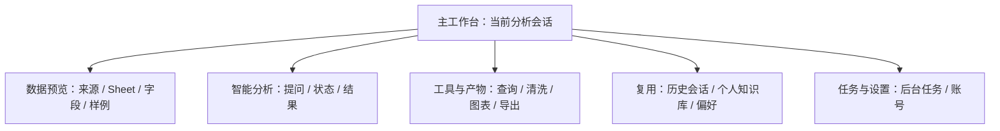
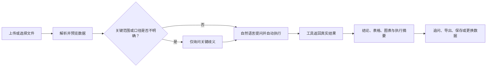

# 产品需求说明书

# 数探｜智能数据分析 Agent

| 文档项 | 内容 |
| --- | --- |
| 文档版本 | V1.2 |
| 文档状态 | 产品方案 |
| 产品形态 | 面向业务分析的对话式 AI 数据工作台 |
| MVP 优先用户 | 使用 CSV 或 Excel 做日常经营分析、临时取数，但缺少 SQL 与专业分析能力的运营及业务人员 |
| 本次修订 | 2026-07-20 |

> 投递阅读请优先查看：[PRD 精简版](./数探-Data-Analysis-Agent-PRD-精简版.md)。本文件保留完整需求、验收、风险与评测信息。

## 修订记录

| 版本 | 日期 | 修订说明 |
| --- | --- | --- |
| V1.0 | 2026-03-10 | 建立产品需求框架，明确数据分析闭环与版本范围。 |
| V1.1 | 2026-05-31 | 补充功能规格、可信执行、安全治理与验收条目。 |
| V1.2 | 2026-07-20 | 收窄 MVP，补充需求依据、决策取舍、职责边界、异常与评测闭环。 |

## 目录

1. 产品摘要
2. 背景、问题定义与调研边界
3. 用户、场景与价值主张
4. 产品目标、非目标与设计原则
5. 竞品分析与关键产品决策
6. MVP 范围、信息架构与核心流程
7. 功能需求、优先级与验收标准
8. Agent、工具与用户职责边界
9. 异常、撤销与可信结果处理
10. 数据安全、权限与隐私
11. 埋点、指标体系与 AI 评测
12. 非功能需求、风险与版本规划

---

# 1. 产品摘要

数探是一个面向业务分析的 AI 数据工作台。用户上传 CSV 或 Excel 后，可查看数据结构，用自然语言提出经营问题；系统通过受控工具执行查询、清洗、统计与图表生成，并把结论、结果表、图表和执行摘要放在同一会话中，支持继续追问和复用。

MVP 的核心不是覆盖所有数据源或分析方法，而是建立一条可信闭环：**文件上传与理解 → 自然语言提问 → 基于真实数据执行 → 查看依据 → 继续追问**。大模型负责理解、规划和解释；确定性工具负责实际计算和验证。没有真实执行依据时，系统不得生成确定性数据结论。

| 版本范围 | 说明 |
| --- | --- |
| MVP 核心闭环 | CSV/Excel 上传、数据预览、多 Sheet/多源选择、对话分析、受控 SQL/统计/清洗/图表工具、工具状态与结果产物、多轮会话、停止与有限重试。 |
| P1 复用能力 | SQL 数据库、Google Sheets、HTTP API、本地工作区、报告/PPT/Dashboard 导出、账号、历史会话、个人知识库、后台任务等。 |
| P2 规模化能力 | 团队协作与权限、定时分析、主动异常发现、企业级数据治理、完整的数据生命周期与审计能力。 |

# 2. 背景、问题定义与调研边界

## 2.1 使用场景与核心矛盾

运营及业务人员经常拿到活动、销售、渠道或用户明细，需要临时回答“哪个渠道转化较高”“本月销售如何变化”“哪些记录异常”等问题。问题通常能用业务语言表达，但完成可信答案仍涉及文件整理、字段理解、口径确认、计算、图表和汇报。

核心矛盾是：

> 业务人员能够提出分析问题，但缺少 SQL、数据处理和分析方法，同时又难以判断通用大模型给出的结论是否基于真实数据。

| 现有方式 | 对高频临时分析的限制 | 数探优先解决什么 |
| --- | --- | --- |
| Excel | 手工筛选、透视、公式和图表依赖操作经验；口径与过程不易复用。 | 先理解文件，再用自然语言完成常见汇总、趋势、Top N 和质量检查。 |
| SQL/分析师 | 结果可靠，但业务人员需要掌握 SQL 或等待排期；追问需反复沟通。 | 把问题、数据范围、工具执行和追问放进一个会话。 |
| 传统 BI/智能 BI | 适合已有模型和固定看板；临时文件、探索问题和连续追问成本较高。 | 面向文件起步的临时探索，不替代固定经营看板。 |
| 通用大模型 | 提问门槛低，但用户难判断字段、计算和结论是否来自当前数据。 | 以工具结果为结论依据，并展示对用户有用的执行摘要。 |

高频需求是上传文件后的字段理解、汇总比较、趋势、Top N、基础数据质量检查和结果复核；回归、聚类、预测、复杂多表关联、数据库接入与团队协作是扩展需求，不决定 MVP 成败。

## 2.2 市场研究与产品判断

数探的产品定义综合公开资料研究、竞品分析和业务分析流程观察，重点关注 AI 在知识工作中的采用，以及对话式分析产品如何连接真实数据与业务口径。

| 公开研究信号 | 可引用数据 | 对产品定义的启示 |
| --- | --- | --- |
| AI 已进入知识工作日常流程 | Microsoft 与 LinkedIn 的 [2024 Work Trend Index](https://www.microsoft.com/en-us/worklab/work-trend-index/2024/) 覆盖 31 个国家/地区的 31,000 名知识工作者：75% 的受访者已在工作中使用 AI；在 AI 使用者中，78% 自带 AI 工具。 | 用户会更频繁地以自然语言寻求答案，但企业数据、口径和工具边界不能交由通用模型自行假设。 |
| 生成式 AI 正进入业务职能 | McKinsey 的 [The state of AI in early 2024](https://www.mckinsey.com/capabilities/quantumblack/our-insights/the-state-of-ai) 显示，65% 的受访组织已在至少一个业务职能中经常使用生成式 AI，高于 2023 年的 33%。 | 产品竞争不只在“能否对话”，更在于能否把对话连接到可验证的数据执行和业务流程。 |

| 产品判断 | 对应设计 |
| --- | --- |
| 临时探索类问题适合用自然语言发起分析。 | 用户可直接描述业务目标，由 Agent 组织数据查询、清洗、统计和图表任务。 |
| 可信度来自数据范围、工具结果和口径说明。 | 每个数值结论展示数据范围、执行摘要和结果来源。 |
| 固定经营指标更适合稳定看板。 | 数探聚焦临时取数、探索分析与连续追问，不替代固定经营看板。 |
| 业务口径需要长期沉淀。 | 个人知识库保存指标定义、业务规则和背景知识，并在后续对话中检索复用。 |

# 3. 用户、场景与价值主张

## 3.1 MVP 用户与非优先用户

| 用户 | 场景与目标 | MVP 优先级 |
| --- | --- | --- |
| 运营及业务人员 | 基于 CSV/Excel 完成经营复盘、临时取数、渠道/商品比较和数据质量检查；缺少 SQL 与专业分析能力。 | 优先用户 |
| 数据分析师 | 将其作为字段浏览、查询验证和图表初稿的效率工具。 | 可使用，但不是 MVP 的主验证对象。 |
| 管理者 | 阅读已生成的结果与依据。 | 结果消费者，不设计为独立工作流。 |
| 企业管理员、协作团队 | 管理企业数据源、权限、治理与共享。 | 后续版本重点。 |

## 3.2 核心任务与成功定义

> 当我拿到一份业务文件、需要在有限时间内回答经营问题时，我希望不用先学习 SQL，也不用盲信模型；我能确认系统使用了什么数据，看见它实际做了什么，并继续追问或复用结论。

| 核心任务 | 用户完成标准 |
| --- | --- |
| 上传并理解数据 | 知道已选文件/Sheet、字段、类型、样例、缺失与可分析范围。 |
| 发起并获得分析 | 问题在数据和口径充分时直接执行；关键歧义时获得简短确认。 |
| 核验结果 | 能看到数据范围、计算或 SQL 摘要、结果表/图表和限制说明。 |
| 继续追问与复用 | 后续问题继承同一会话的确认信息；登录用户可保存历史和个人口径。 |

## 3.3 产品定位与价值主张

数探不是“替用户猜答案”的聊天机器人，也不替代企业的固定经营看板。它是面向文件起步的对话式分析工作台：把**真实数据、受控执行与可核验解释**组合起来，降低业务人员完成一次临时经营分析的门槛。

# 4. 产品目标、非目标与设计原则

## 4.1 产品目标与非目标

| 类型 | 内容 |
| --- | --- |
| 产品目标 | 让优先用户从 CSV/Excel 上传开始，在同一会话中获得可复核的基础分析结果，并能继续追问。 |
| 可信目标 | 每个确定性数值结论都可对应当前数据范围和至少一个真实工具结果；无依据时显式说明限制。 |
| 效率目标 | 减少文件、表格、查询和图表工具之间的切换；不以承诺固定秒级响应为目标。 |
| 非目标 | 不在 MVP 中替代专业分析师的复杂建模、企业 BI 的固定看板、企业级数据治理或高风险经营决策审批。 |
| 非目标 | 不将模型的内部思维链展示给用户，也不把“模型会解释”视为“结果已验证”。 |

## 4.2 产品设计原则

| 原则 | 解决的用户问题 | 产品要求 |
| --- | --- | --- |
| 自动执行优先 | 每一步都确认会让不会 SQL 的用户中断。 | 数据、字段、时间和口径充分时直接执行并展示状态。 |
| 关键歧义确认 | 错误口径会比一次追问造成更大损失。 | 时间范围、指标定义、关联字段、多个可选数据源等会显著改变结果时才询问。 |
| 真实执行优先 | 自然语言答案可能看似合理却没有数据依据。 | 查询、计算、清洗和图表由工具执行；模型不得凭空填充数值。 |
| 过程可追溯 | 用户需要判断结果能否用于汇报。 | 展示数据范围、工具步骤、SQL/计算摘要、结果来源与限制；大结果可通过产物读取。 |
| 不暴露完整推理 | 冗长内部推理不可稳定复核，也会增加阅读负担。 | 展示可行动的计划、状态和结果摘要，不展示模型内部思维链。 |
| 失败显式反馈 | 伪造成功会伤害信任。 | 工具失败、数据不足、权限不足或口径不清时说明原因、已完成部分和下一步。 |
| 成本与稳定性控制 | 长上下文、重复调用和不可控重试会拉长等待并增加成本。 | 使用工具轮次限制、结果摘要/压缩、超时、有限重试、取消和调用预算；具体阈值由实现配置决定。 |

# 5. 竞品分析与关键产品决策

## 5.1 竞品范式与机会判断

| 维度 | 通用大模型 | 传统 BI / 智能 BI | 开源数据分析 Agent | 数探的机会 |
| --- | --- | --- | --- | --- |
| 目标用户 | 泛知识工作者 | 已有数据模型与报表体系的业务团队 | 开发者、技术团队 | 缺少 SQL 的运营及业务人员 |
| 核心场景 | 快速探索与问答 | 固定指标消费、报表制作 | 可编排的分析自动化 | 文件起步的临时经营分析与追问 |
| 数据接入门槛 | 文件上传容易，数据边界依赖用户核验 | 常需先建模、建报表或接入治理 | 需配置代码、模型与运行环境 | 优先 CSV/Excel，预览后直接分析 |
| 是否需要提前建模 | 通常不需要 | 通常需要 | 取决于实现 | MVP 不要求预建语义模型 |
| 临时分析/多轮追问 | 强，但依据展示不一 | 相对弱或依赖报表上下文 | 强 | 支持，并绑定活动数据范围 |
| 过程可追溯 | 依产品而异 | 可追溯到模型/报表 | 偏技术日志 | 展示工具轨迹、结果产物与数据范围 |
| 业务口径沉淀 | 通常为聊天上下文 | 通常在语义模型中 | 需自行构建 | 个人知识库沉淀指标、规则和背景知识 |
| 幻觉控制 | 主要依赖模型与提示 | 依赖模型和治理 | 依赖工具设计 | 强制数据工具承接数值结论，评测数据幻觉代理指标 |
| 部署与使用成本 | 低启动成本 | 建设成本较高 | 技术使用成本高 | 面向业务用户隐藏模型与工具配置，但仍需安全部署 |

结论：数探的差异化不在于“比通用模型多回答问题”，而在于降低从文件到可信结论的路径成本；不以取代 BI 或通用模型为目标。

## 5.2 关键产品决策与取舍

| 决策 | 用户问题 | 选择方案 | 暂缓/放弃方案 | 选择理由与风险 |
| --- | --- | --- | --- | --- |
| 对话式分析，而非固定看板 | 临时问题往往不在预设维度中，且需要连续追问。 | 以会话组织问题、数据、工具过程和结果。 | 用数探替代高频固定看板。 | 适合探索；固定日报仍应交给 BI。风险是对话结果难横向比较，需靠保存与导出补足。 |
| 自动执行，而非逐步确认 | 频繁确认抬高使用门槛。 | 信息充分即执行；仅在口径、时间、关联字段和数据范围等关键歧义处确认。 | 每次工具调用均要求用户批准。 | 减少中断；风险是模型误判充分性，需展示范围并允许更正。 |
| 展示工具轨迹，不展示完整推理 | 用户需要验证依据，不需要阅读不稳定的内部思维。 | 展示工具名称、状态、数据范围、SQL/计算摘要、结果与错误。 | 暴露完整 Chain of Thought。 | 可复核且可读；风险是摘要不足，需支持查看结构化结果产物。 |
| 建立个人知识库 | 指标定义和业务规则每次重复说明，易造成口径漂移。 | 保存指标、规则、背景知识及可检索文档；以用户私有范围检索。 | 只保存聊天记录。 | 知识库服务于口径复用，而非聊天归档。风险是过期知识影响分析，需要编辑、启停和确认机制。 |
| MVP 优先文件上传 | 企业数据源接入、权限与治理成本高。 | 先支持 CSV/Excel，验证分析闭环。 | 在 MVP 把数据库、API、在线表格和协作作为主路径。 | 文件成本低、范围广；风险是文件版本和多文件关联歧义，需要显式提示。 |

# 6. MVP 范围、信息架构与核心流程

## 6.1 需求优先级与版本边界

| 优先级 | 范围 | 边界与说明 |
| --- | --- | --- |
| P0：核心闭环 | CSV/Excel 上传；文件和 Sheet 选择；字段、类型、缺失值及样例预览；自然语言提问；查询、清洗、统计、图表工具；表格/图表/结论；执行依据；多轮追问；失败提示、有限重试与取消。 | 上传格式为 `.csv`、`.xlsx`、`.xls`，单次最多 5 个文件；大 Excel 支持异步解析。文件大小和行数上限在技术方案与压测后配置，并在上传前明确告知。 |
| P1：留存与复用 | 登录、历史会话保存/恢复、导出、个人知识库、多文件活动范围、图表能力、记录重命名/删除。 | 知识库按个人范围隔离；多文件关联必须明确数据源、表与关联键，不能静默假设。 |
| P2：规模化扩展 | 企业数据库/API/在线表格接入、团队知识库、协作与权限、定时分析、主动异常发现、企业级治理。 | 先满足连接、凭据、权限、稳定性和审计要求，再进入规模化使用。 |

## 6.2 信息架构

## 6.3 核心用户流程

数据源在任务启动时冻结为快照；用户之后切换活动数据或工作区，不应篡改正在运行任务的数据范围。后续追问默认继承已确认范围，但必须允许用户改选来源或更正口径。

## 6.4 首页与数据入口

*图 1：首页工作台。用户可从输入区添加数据、调用分析工具或直接输入分析问题。*

# 7. 功能需求、优先级与验收标准

## 7.1 FR-01 文件上传与数据预览（P0）

| 项目 | 需求 |
| --- | --- |
| 用户目标 | 上传业务文件，确认系统读取的是正确 Sheet、字段和数据。 |
| 前置条件 | 用户在当前会话创建数据上下文；可为游客或登录用户。 |
| 主流程 | 选择 `.csv`、`.xlsx` 或 `.xls` → 服务端解析 → 展示数据源、表/Sheet、字段、样例行与活动状态 → 用户选择本轮分析范围。Excel 解析较重时进入后台任务，完成后再挂载。 |
| 输入限制 | 单次最多 5 文件，仅接受上述格式；文件大小和行数上限由技术方案和压测确定，并在上传前向用户展示。 |
| 异常流程 | 空文件、损坏/加密/不支持文件、无可读 Sheet、解析失败时展示文件名与可行动原因；不进入分析。单个文件失败不应掩盖同批次其他成功文件。 |
| 输出与状态 | `未选择 → 上传中/解析中 → 可预览 → 已选为活动数据 → 分析中`；预览至少包括名称、表/Sheet、字段、推断类型、样例行和可用范围。 |
| 验收标准 | 1) 合法 CSV/Excel 成功后能获得 schema 预览；2) 多 Sheet 可识别并选择可分析表；3) 重名字段、类型推断异常或空内容有明确提示或限制说明；4) 未有可用活动数据时，数据依赖型分析不得伪造结果；5) 解析失败后可重新上传。 |

说明：对重复列名、类型误判不要求静默自动修复；系统应给出可见提示，并允许用户改选 Sheet、字段或重新处理。

*图 2：文件上传。用户在同一入口完成文件选择、上传进度查看和解析发起。*

*图 3：数据预览。用户在分析前确认 Sheet、字段和样例数据。*

## 7.2 FR-02 对话式分析与歧义确认（P0）

| 项目 | 需求 |
| --- | --- |
| 用户目标 | 用业务语言得到真实数据支持的分析，而不必指定 SQL 或统计方法。 |
| 前置条件 | 至少一个活动数据源可读取；会话保存当前数据结构和已确认上下文。 |
| 主流程 | 用户提问 → Agent 识别目标与可用字段 → 信息充分则选择工具执行 → 返回结论、结果和下一步追问；多轮对话继承会话上下文。 |
| 何时确认 | 指标口径、时间范围、多个候选表/字段、关联键或用户请求本身会显著改变结果时。 |
| 不应确认 | 已明确的字段、范围和常规聚合；不得把可由 schema 或工具验证的信息反问给用户。 |
| 异常流程 | 无数据、字段不存在、数据不足、口径冲突、模型或工具异常时说明限制，并提供更换字段、缩小问题或重试入口。 |
| 输出与状态 | `等待输入 → 规划/调用中 → 已返回有效结果 / 部分成功 / 失败 / 已取消`；生成中可停止。 |
| 验收标准 | 1) 已明确问题可直接发起工具执行；2) 高影响歧义不会被静默假设；3) 追问能继承活动数据与已确认信息；4) 用户停止后任务进入取消流程，不再以成功完成展示；5) 没有工具依据时不输出确定性数值结论。 |

*图 4：分析工具。用户可显式选择数据理解、图表、建模、预测或导出能力，也可直接通过自然语言发起任务。*

## 7.3 FR-03 受控工具执行与结果呈现（P0）

| 项目 | 需求 |
| --- | --- |
| 用户目标 | 获得表格、图表和可用于判断的结论，并知道其依据。 |
| 前置条件 | 问题、数据范围和可用工具已确定。 |
| 主流程 | Agent 生成结构化调用参数 → schema/参数校验 → SQL、数据处理、统计或图表工具实际执行 → 工具结果回写会话 → 模型基于结果组织解释。 |
| 安全与限制 | SQL 经 AST 只读校验；工具参数受 Schema 校验；工具结果可做摘要或持久化产物，避免长结果无限进入上下文。 |
| 异常流程 | SQL 语法/执行失败、图表失败、超时或工具返回空结果时，返回失败原因、已完成步骤和可选重试；不得把失败替换为编造结果。 |
| 输出结果 | 结果表或图表、简短结论、数据范围、工具步骤、SQL/计算摘要与限制说明。图表推荐由模型完成，生成由确定性工具完成。 |
| 验收标准 | 1) 数值、排名和图表数据可追溯到工具结果；2) 写入型 SQL 被阻断；3) 图表失败不影响已成功表格的保留；4) 结果为空时明确“未找到数据”而非给出排名；5) 用户可查看工具状态和结构化结果摘要。 |

*图 5：对话结果。结论、数据依据和后续追问在同一会话内连续呈现。*

*图 6：图表结果。图表与对应分析结论共同呈现，便于复核与汇报。*

## 7.4 FR-04 会话、历史、导出与个人知识库（P1）

| 项目 | 需求 |
| --- | --- |
| 用户目标 | 复用已完成分析和已确认业务口径。 |
| 主流程 | 登录后保存/恢复、重命名或删除历史会话；将结果导出为 Excel、报告、PPT、图表或 Dashboard；维护指标定义、业务规则、背景知识和可检索文档。 |
| 设计理由 | 会话保存的是分析过程；知识库沉淀的是可跨会话复用的口径和规则，两者不可互相替代。 |
| 异常流程 | 历史恢复缺少文件、产物失效或知识库无检索结果时须提示状态，不将旧结果误作当前数据结果。 |
| 验收标准 | 1) 用户只能读写自己的历史、偏好和个人知识库；2) 知识条目支持启停/编辑，检索无结果有明确反馈；3) 删除源文件后，依赖该文件的会话/产物按实际保留状态提示，而非静默恢复。 |

*图 7：数据知识库。用户可维护指标定义、业务规则和背景知识，供后续分析检索复用。*

*图 8：知识库引用。系统基于已沉淀的业务口径回答问题，并在口径缺失时引导用户补充定义。*

## 7.5 FR-05 多源数据接入与本地工作区（P1）

除 CSV/Excel 外，数探为已具备数据连接条件的用户提供统一的数据接入入口。该能力服务于持续分析与多源对比，不改变 MVP 以文件分析验证核心闭环的定位。

| 数据源/能力 | 用户输入 | 核心规则 | 验收标准 |
| --- | --- | --- | --- |
| SQL 数据库 | SQLAlchemy 连接字符串 | 连接成功并通过只读校验后才进入分析范围。 | 可显示数据库表与 Schema；写入、删除和 DDL 语句被阻断。 |
| Google Sheets | 表格 URL/ID 与服务账号授权 | 只读取用户已授权的工作表。 | 连接失败时区分网络、授权和资源不存在。 |
| HTTP API | 返回表格型 JSON 的地址及授权信息 | 支持无认证、Bearer Token 与 `X-API-Key`。 | 校验响应结构、状态码与可解析性后再注册数据源。 |
| 多文件/多源 | 活动数据源、表和关联键 | 关联字段不明确时必须由用户确认。 | 会话明确展示本轮使用的来源、表和关联范围。 |
| 本地工作区 | 目录路径与只读/可编辑权限 | 仅访问用户明确挂载的目录；敏感路径不可访问。 | 挂载、切换、卸载和权限变更均有状态反馈；运行任务保持启动时的目录快照。 |

## 7.6 FR-06 分析工具、图表与交付产物（P1）

| 能力类别 | 功能范围 | 用户获得的结果 |
| --- | --- | --- |
| 数据理解与清洗 | 数据画像、缺失值处理、截尾、缩尾、重复与异常检查。 | 数据质量摘要、问题字段和处理结果。 |
| 查询与统计 | 安全 SQL、分组汇总、Top N、趋势、十分位和变量筛选。 | 可复核的结果表、计算摘要和字段说明。 |
| 建模与预测 | 线性回归、逻辑回归、决策树、K-Means、ARIMA、SARIMA、Prophet、VAR、GRU。 | 模型结果、分群/预测序列与限制说明。 |
| 可视化 | 自动选图及柱状图、折线图、饼图、散点图等多类型图表。 | 与字段、指标、时间粒度相对应的图表。 |
| 交付产物 | Excel、报告、PPT、图表文件与交互式 Dashboard。 | 可下载、可恢复的分析产物。 |
| 后台任务 | Excel 解析、导出和长时分析任务。 | 排队、运行、成功、失败、取消状态及下载入口。 |

用户既可直接提出业务问题，也可通过工具面板显式选择数据质量、图表、建模、预测、导出等能力。对于耗时操作，系统以后台任务运行并保留任务状态与产物索引。

## 7.7 FR-07 账号、额度、偏好与历史分析（P1）

| 模块 | 功能 | 关键规则 |
| --- | --- | --- |
| 账号 | 邮箱密码注册、登录、退出与昵称设置。 | 邮箱唯一；密码以安全摘要保存；退出后不得继续显示上一账号的私有会话。 |
| 体验与额度 | 未登录用户每天 5 次分析；登录用户每天 30 次分析。 | 同一身份同时仅运行 1 个分析任务；额度按自然日重置，登录后当天体验用量并入账户额度。 |
| 历史分析 | 保存、加载、重命名、删除与恢复会话。 | 会话、数据源引用、图表与产物按用户隔离；恢复时标明数据源是否可用。 |
| 个人知识库 | 指标定义、业务规则、背景知识与导入文件的新增、编辑、启停、删除和检索。 | 仅登录用户可长期维护；检索结果必须标明引用来源。 |
| 偏好记忆 | 语言、主题、助手偏好与常用展示方式。 | 跨会话生效，不影响其他用户；当前问题的明确要求优先。 |
| 示例数据 | 匿名演示数据与示例问题。 | 用于降低首次体验门槛，不进入用户实际数据空间。 |

*图 9：个人偏好。用户可维护稳定的输出偏好，使后续会话保持一致。*

## 7.8 FR-08 扩展集成与协作能力（P2）

| 功能 | 产品范围 | 边界 |
| --- | --- | --- |
| MCP 服务接入 | 接入外部工具和服务，扩展数据与分析能力。 | 外部工具必须经过权限、参数和结果边界控制。 |
| Teams 协作 | 将复杂任务拆分给轻量协作角色。 | 面向复杂任务；团队成员仅获得完成任务所需的最小工具权限。 |
| 团队知识库与协作 | 团队口径、分享与权限协作。 | 建立在个人隔离、数据生命周期和审计基础之上。 |
| 定时与主动分析 | 定时生成分析产物、发现异常并发出提醒。 | 先明确数据源稳定性、告警阈值和责任人。 |

## 7.9 需求总览

| 编号 | 功能 | 优先级 | 用户价值 | 版本范围 |
| --- | --- | --- | --- | --- |
| FR-01 | 文件上传、解析、Sheet/字段预览与活动范围 | P0 | 先确认数据，再分析。 | MVP |
| FR-02 | 自然语言提问、多轮追问、关键歧义确认 | P0 | 降低 SQL 门槛，避免静默假设。 | MVP |
| FR-03 | 查询、清洗、统计、图表与依据展示 | P0 | 用真实执行替代模型编造。 | MVP |
| FR-04 | 失败、取消、有限重试与部分结果 | P0 | 失败可理解、可恢复。 | MVP |
| FR-05 | SQL、Google Sheets、HTTP API、多文件与工作区 | P1 | 扩展持续分析的数据入口。 | P1 |
| FR-06 | 高级分析工具、图表、导出与后台任务 | P1 | 提升分析深度和交付效率。 | P1 |
| FR-07 | 账号、额度、历史、知识库与偏好 | P1 | 建立个人分析资产和复用机制。 | P1 |
| FR-08 | MCP、Teams、团队协作、定时与主动分析 | P2 | 面向规模化协作与自动化。 | P2 |

# 8. Agent、工具与用户职责边界

| 能力 | 大模型 | 确定性工具/系统 | 用户 |
| --- | --- | --- | --- |
| 理解自然语言问题 | 主导意图理解、拆解和追问方案。 | 提供 schema、可用工具和约束。 | 提供业务目标与上下文。 |
| 确定分析口径 | 提议并识别歧义。 | 校验字段和数据是否支持。 | 对关键歧义确认或修正。 |
| 数据查询与计算 | 生成调用参数、组织步骤。 | 实际执行 SQL、清洗、统计与验证。 | 查看范围与结果。 |
| 数据结果生成 | 不得虚构数值或记录。 | 返回真实结果、错误和产物引用。 | 判断是否满足业务问题。 |
| 图表推荐 | 推荐与任务语义匹配的图表。 | 基于真实结果生成图表。 | 可选择或切换表达方式（以实际界面能力为准）。 |
| 业务口径复用 | 组织检索结果进入当前任务。 | 私有知识库返回已保存内容。 | 维护、启停或确认口径。 |
| 高风险结论 | 标记不确定性、避免无依据因果断言。 | 校验数据、权限和执行边界。 | 对重要决策进行人工复核。 |

职责边界的核心是：模型负责**理解、规划、解释**，工具负责**查询、计算、验证**，用户负责**目标、关键口径和最终业务判断**。模型输出不能越过工具结果成为事实来源。

# 9. 异常、撤销与可信结果处理

## 9.1 异常状态与处理

失败时的产品原则：**宁可说明无法完成，也不得在没有真实执行依据时生成确定性数据结论。**

| 场景 | 系统处理 | 用户可见反馈/下一步 |
| --- | --- | --- |
| 文件解析失败、空文件、损坏或加密文件 | 不注册为可分析数据源；保留其他文件的成功结果。 | 指出文件与原因，支持重新上传。 |
| 字段名重复或类型识别不可靠 | 标示歧义，不将不确定类型静默用于关键计算。 | 查看字段、改选 Sheet/文件或重新处理。 |
| 多文件关联字段不明确 | 不自动声称关联正确。 | 列出候选字段，请用户确认或退回单文件分析。 |
| SQL/Python 或分析工具失败 | 保留调用错误、已成功工具结果和任务状态；在策略允许时有限重试。 | 说明失败步骤，并提供重试或修改问题入口。 |
| 查询超时、模型服务不可用 | 结束或标记失败，不输出未得到的结果。 | 告知超时/服务状态，并提供缩小范围或稍后重试入口。 |
| 图表生成失败 | 保留已成功的数据表，不伪造图表。 | 提供表格、失败原因及其他可选图表类型。 |
| 知识库检索无结果 | 不把未检索到的口径当作存在。 | 说明无匹配结果，提示新增或手动确认口径。 |
| 用户切换数据文件/工作区 | 运行任务继续使用启动时的数据快照；新任务使用新范围。 | 显示新旧范围，避免混淆。 |
| 用户修改统计口径 | 新建或重新执行后续分析步骤，不能覆盖旧结果的来源。 | 标记口径变更与结果适用范围。 |
| 用户取消任务 | 发送协作式取消请求；终态为已取消或取消失败。 | 展示已完成部分，不把任务标为成功。 |
| 部分成功 | 返回已经成功的表、图或产物，并列出失败部分。 | 标记“部分成功”，说明不可据此推断的范围。 |
| 登录过期或历史恢复失败 | 拒绝访问私有内容；不泄露其他用户内容。 | 要求重新登录或说明资源不存在/已失效。 |
| 模型输出与工具结果不一致 | 以工具结果为准，阻止或降级确定性结论并记录异常。 | 显示“结果不一致，需复核”，提供工具结果。 |
| 用户要求数据中不存在的结论 | 识别字段/证据不足或因果边界。 | 明确不能证明，并说明需要何种数据或验证方法。 |

## 9.2 撤销与流程切换

已执行的查询和产物不可通过“撤销”改变历史事实；用户可撤销的是后续操作意图，例如停止任务、切换活动数据、修正口径或发起新的分析分支。会话应保留每个结果对应的数据范围与工具记录，避免新选择覆盖旧结论的依据。

# 10. 数据安全、权限与隐私

## 10.1 安全基线

| 主题 | 安全要求 |
| --- | --- |
| 身份与隔离 | 登录用户的历史、偏好和知识库按用户范围存储；知识库接口要求登录。 |
| 凭据 | 模型与外部数据源凭据由服务端/环境配置管理，不下发浏览器、不进入仓库。 |
| SQL 与工作区 | SQL 经过 AST 级只读校验；工作区屏蔽 `.env`、`.git`、`.ssh`、私钥等敏感路径，并区分只读/可编辑权限。 |
| 浏览器防护 | 采用 CSP、同源写保护、内容类型保护和限制性权限头。 |
| 模型数据边界 | 完成回答所需提示词、schema 和相关数据由服务端发送至部署方配置的模型服务；部署方需按自身政策选择模型接入。 |

## 10.2 数据生命周期与安全建设

| 主题 | 要求 |
| --- | --- |
| 文件与会话访问 | 用户只能访问自己的文件、分析、产物和知识库；服务端接口必须以认证身份而非前端传参决定归属。 |
| 删除与保留 | 文件删除后应明确关联会话、缓存、产物和知识索引的状态；数据保留周期、备份恢复和彻底删除策略需由部署方配置并记录。 |
| 敏感数据 | 上传和预览时提示可能的个人/敏感字段；日志默认避免完整原始数据、密钥和令牌。字段自动分级、脱敏与 DLP 属于后续能力。 |
| 导出与分享 | 默认私有；对外分享、下载水印、审批和团队权限在团队协作版本提供。 |
| 提示注入与工具权限 | 将文件内容和知识内容视为不可信输入；工具调用继续受 schema、只读 SQL、路径权限和最小权限约束，不能按文档中的指令提升权限。 |
| 执行环境 | SQL/代码/工作区工具应限制可访问资源、写入范围、超时与审计；完整沙箱隔离和企业审计能力尚需专项验证。 |

# 11. 埋点、指标体系与 AI 评测

## 11.1 指标体系

以下为产品指标定义，非已上线经营结果；上线或可用性测试后再填写实际数值和样本口径。

| 类别 | 指标 | 定义要点 |
| --- | --- | --- |
| 产品价值 | 首次分析成功率、首个有效结果耗时、有效任务完成率、结果采纳率、多轮追问率、历史复用率、知识库口径复用率、可信度评分 | 明确“有效结果”需有用户确认或预定义任务通过，不能只以模型输出计数。 |
| Agent 任务 | 工具路由正确率、必需工具召回率、禁用工具违规率、SQL 执行成功率、SQL 结果正确率、图表适配率、任务完成率、数据幻觉率、安全拒绝正确率 | 以冻结案例和人工抽检结合；区分工具可执行与结果正确。 |
| 效率与成本 | 平均工具调用次数、无效重复调用率、平均端到端耗时、P50/P95、平均 Token、单任务成本、达到最大轮次比例 | API 未返回 usage 或未配置价格时标记 `unavailable`/`N/A`，不估算。 |
| 安全与质量 | 被阻断的危险 SQL、越权访问尝试、敏感字段提示覆盖、失败后伪造成功率、工具结果与最终答案不一致率 | 用于监控可信执行，而非替代人工审核。 |

最小埋点事件：`file_upload_started/completed/failed`、`data_previewed`、`analysis_submitted`、`clarification_requested/answered`、`tool_started/succeeded/failed`、`analysis_canceled`、`result_viewed/exported`、`knowledge_retrieved`、`session_restored/failed`。事件只记录必要元数据与脱敏摘要，避免上传原始数据到日志。

## 11.2 AI 评测目标与数据集

离线评测在固定数据、模型配置和案例下运行真实工具调用，用于比较 Prompt A/B 对工具路由、SQL、图表、回答安全性和效率的影响；它不等同于真实用户效果评估。

| 项目 | 评测基线 |
| --- | --- |
| 基准集 | `benchmark_v1`，55 条中文业务问题，使用匿名的流量、订单与广告演示数据。 |
| 覆盖 | 查询、聚合、Top-N、趋势、图表、质量概览、清洗、K-Means、安全拒答、字段/数据不足与因果边界。 |
| 划分 | 按固定种子 `20260712` 冻结为 35 条开发集与 20 条独立测试集；测试集不参与 Prompt B 设计。 |
| 覆盖限制 | 三个工作簿均为单表，JOIN/多数据源关联不纳入量化得分；个人知识库无独立测试数据，亦不计入该基准集。 |
| Prompt A | 基线 Prompt，不增加评测覆盖指令。 |
| Prompt B | 仅增加证据优先、先查字段、避免重复失败调用、图表语义匹配、数据不足与因果边界约束。 |

## 11.3 指标、失败归因与迭代闭环

| 环节 | 方法 |
| --- | --- |
| 指标定义 | 工具路由正确率要求必需工具均到达且未用禁用工具；SQL 结果正确率比较执行结果的列形状、行数、值、排序和数值容差，而非比较 SQL 文本；幻觉为代理指标：无数据工具却输出数字，或违规作确定性因果主张。 |
| 失败类型 | 字段理解错误、工具选择错误、SQL 语法错误、SQL 可执行但结果错误、漏掉必要工具、重复调用、图表不适配、无依据结论、应拒绝未拒绝、过度确认中断、上下文过长丢失历史。 |
| 归因方法 | 先定位结构化失败案例，再回看工具轨迹、SQL 和最终回答；区分 Prompt、工具契约、校验规则、数据集覆盖和人工判定问题。 |
| 调整规则 | 只用开发集失败设计 Prompt B 候选；人工审核并冻结后，再在独立测试集比较。保持模型、参数、数据、案例、重复次数和 Agent 限制不变。 |
| 尚未解决 | 单次运行不构成统计显著性；离线基准无法代表真实文件质量、多表关联、个人知识库与真实用户采纳。 |

## 11.4 保留的真实独立测试结果

以下数据原样来自 `evals/reports/prompt_ab_test_report.md` 的 20 案例独立测试，`repeat=1`。不将其美化为线上效果或统计显著结论。

| 指标 | Prompt A | Prompt B | 绝对变化（B-A） |
| --- | ---: | ---: | ---: |
| 工具路由正确率 | 95.00% | 95.00% | 0.00 个百分点 |
| SQL 执行成功率 | 100.00% | 100.00% | 0.00 个百分点 |
| SQL 结果正确率 | 43.75% | 50.00% | +6.25 个百分点 |
| 端到端任务完成率 | 50.00% | 55.00% | +5.00 个百分点 |
| 幻觉代理指标 | 0.00% | 0.00% | 0.00 个百分点 |
| 图表合适率 | 100.00% | 100.00% | 0.00 个百分点 |
| 平均 Token | 19098.75 | 20061.85 | +963.10（约 +5.04%） |
| 平均延迟 | 22731.15 ms | 17223.65 ms | -5508.50 ms（约 -24.23%） |
| 平均成本 | N/A | N/A | 未配置价格，不估算 |

独立测试中 Prompt B 改善 1 个案例、回归 0 个案例。由于每案例仅运行一次，报告明确不作统计显著性声明。开发集 Prompt A 的 35 次结果显示主要失败集中在 SQL 结果错误（16）、图表类型错误（3）、遗漏必需工具（3）和不支持的因果主张（3）；这说明下一轮应优先改进结果校验与任务约束，而不是把“SQL 能执行”当作“分析正确”。

# 12. 非功能需求、风险与版本规划

## 12.1 非功能需求

| 主题 | 要求 |
| --- | --- |
| 可用性 | 网络、模型和工具不可用时返回可区分的失败状态；不在 PRD 中预设未经压测验证的可用性或性能数值。 |
| 性能 | 大文件解析和长任务允许异步执行；展示排队/运行/成功/失败/取消状态。以 P50/P95 和任务完成率持续观测，而非写死秒数。 |
| 可维护性 | 工具、技能、数据源与评测用例有结构化契约；修改 Prompt 或工具 Schema 后应运行对应回归与离线评测。 |
| 可观测性 | 记录脱敏后的任务状态、工具调用、错误类型、耗时、Token/成本可用性和结果产物引用；不得以日志替代数据访问控制。 |

## 12.2 主要风险与应对

| 风险 | 影响 | 应对 |
| --- | --- | --- |
| 字段或口径不清 | 得到错误但看似合理的结论。 | 预览 schema、关键歧义确认、口径写入知识库、结果附限制。 |
| SQL 可执行但结果错误 | 直接伤害经营判断。 | 结果集级评测、参考 SQL、工具结果展示、人工审核高风险结论。 |
| 多文件关联误判 | 产生重复计数或错配。 | MVP 不自动声称关联正确；要求用户确认关联键。 |
| 长上下文/重复调用 | 成本上升、历史丢失或任务超时。 | 上下文压缩、结果摘要、轮次限制、有限重试和取消。 |
| 隐私或越权 | 数据泄露或数据损坏。 | 身份隔离、只读 SQL、路径控制、服务端凭据、最小权限和后续审计建设。 |
| 将离线分数误当产品成果 | 作品集表述失真。 | 保留数据集、划分、次数、指标定义和局限；不外推为用户价值。 |

## 12.3 版本规划

| 阶段 | 目标 | 交付判断 |
| --- | --- | --- |
| 当前 MVP | 验证文件到可信分析结果的闭环。 | P0 验收通过，关键失败可解释，离线评测可复现。 |
| P1 | 提升保存、复用和复杂任务可控性。 | 历史、导出、个人知识库和多源管理的权限/恢复用例通过。 |
| P2 | 面向组织级接入与治理扩展。 | 先完成安全、权限、数据源稳定性与协作需求调研，再决定范围。 |
